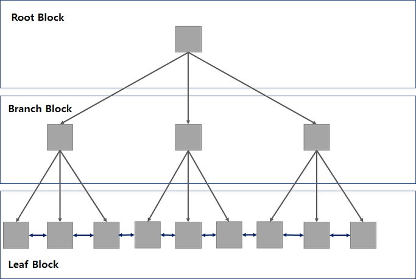
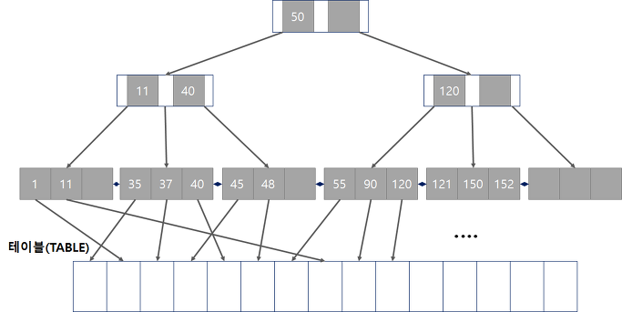
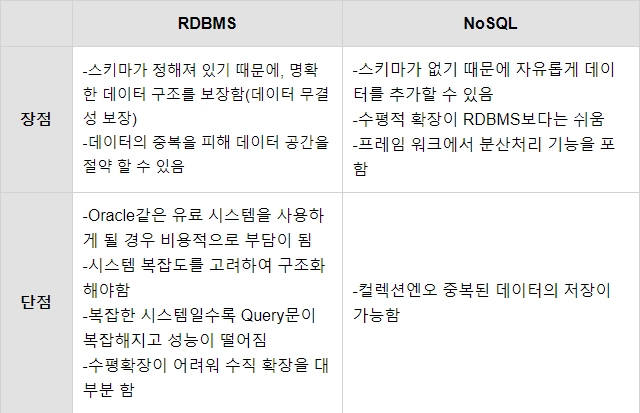

# DATABASE

**:Contents**
* [database pool(connection pool)](#database pool(connection pool))
* [정규화(1차 2차 3차 BCNF)](#정규화(1차-2차-3차-BCNF))
* [트랜잭션 격리 수준(Transaction Isolation Level)](#트랜잭션-격리-수준)
* [트랜잭션 전파 방식(Transaction propagation)](#트랜잭션-전파-방식)
* [트랜잭션이란](#트랜잭션이란)
* [Index를 타지 않는 경우](#Index를-타지-않는-경우)
* [Index의 자료구조는 / 특징은](#Index의-자료구조는-특징은)
* [수정 삭제가 잦은 칼럼에 Index가 적합하지 않은 이유](#수정삭제가-잦은-칼럼에-Index가-적합하지-않은이유)
* [Statement와 PrepareStatement](#Statement와-PrepareStatement)
* [RDBMS와-NoSQL](#RDBMS와-NoSQL)
* [샤딩](#샤딩)
* [Replication](#Replication)
* [파티셔닝](#파티셔닝)


---


### database pool(connection pool)
#### Connection Pool?
- 애플리케이션의 스레드에서 데이터베이스에 접근하기위해 Connection이 필요
- 데이터베이스와 Connection한 객체들을 미리 생성해 Pool에 저장해두었다가, 클라이언트의 요청이 들어올 때마다 사용/반환하는 방식

#### Connection Pool 데이터베이스 접근 과정
(1) 웹 컨테이너가 실행되면 데이터베이스와 연결된 Connection 객체들을 미리 생성해 Pool에 저장    
(2) 클라이언트 요청 시 Pool에서 Connection 객체를 가져와 데이터베이스 접근    
(3) 요청 처리가 끝나면 사용된 Connection 객체를 다시 Pool에 반환    

#### Connection Pool 장점    
- 매 연결마다 Connection 객체를 생성/제거하는 비용 감소    
- 미리 생성된 Connection 객체를 사용하므로 데이터베이스 접근 시간 단축    
- Connection 수를 제한해 부하 조정    

#### Connection Pool 단점  
- Connection 또한 객체이므로 메모리 차지    
- Connection 개수를 잘 못 설정할 경우, 쓸모없는 Connection이 발생할 수 있음

#### Connection이 부족할 경우
- 모든 Connection이 요청을 처리 중일 때, 해당 클라이언트의 요청을 대기 상태로 전환
- Pool에 Connection 객체가 반환되면 순차적으로 요청을 처리

#### Thread Pool과 Connection Pool
- Thread Pool은 작업 처리에 사용되는 스레드를 제한된 개수만큼 정해 놓고 작업 큐(Queue)에 들어오는 작업들을 하나씩 스레드가 맡아 처리하는 것
- WAS(Web Application Server)에서 Thread Pool과 Connection Pool의 Thread와 Connection의 수는 메모리와 직접적으로 관련이 있음
- Connection과 Thread 수를 많이 설정하면 메모리를 많이 차지하고, 반대로 적게 설정할 경우 처리하지 못하는 대기 요청이 많아짐

-----------------------------------------------
### 정규화(1차 2차 3차 BCNF)
#### 정규화(Normalization)란 하나의 릴레이션에 하나의 의미만 존재할 수 있도록 릴레이션을 분해해 나가는 과정
- 비정규형은 하나의 튜플에서 속성을 입력되는 도메인 값으로 여러 개의 값이 들어와서 원자성(Atomic)을 가지지 못한 경우
>  

- 제1 정규형 과정을 통해 원자값이 아닌 도메인을 분해하여 어떤 릴레이션 R에 속한 모든 도메인이 원자값으로만 되어 있도록 설계
>  

- 제2 정규형(Second Normal Form : 2NF)은 어떤 릴레이션 R이 제1정규화에 속하고 기본키에 속하지 않는 모든 속성이 키본키에 완전 함수적 종속이면 충족하는 정규화
>  

- 제3 정규형(Third Normal Form : 3NF)은 어떤 릴레이션 R이 제2정규화에 있으며 기본키에 속하지 않는 모든 속성이 기본키에 이행적 함수 종속이 아닌 상태의 관계
>  

- 보이스 코드 정규형(Boyce-Codd Normal Form : BCNF)은 릴레이션 R의 모든 결정자가 후보키이면 릴레이션 R은 Boyce-Codd 정규형에 속하는 상태.
>  

- BCNF 정규형에 속하는 릴레이션은 모두 제3 정규형에 속하지만 역으로는 성립되지 않는다는 점도 기억해 두어야 할 중요한 포인트


cf) https://minimax95.tistory.com/entry/%EC%A0%95%EA%B7%9C%ED%99%94Normalization-%EA%B0%9C%EB%85%90%EA%B3%BC-%EA%B8%B0%EB%B3%B8-%EA%B3%BC%EC%A0%95


-----------------------------------------------

### 트랜잭션
- 여러개의 작업이 발생할때 하나의 단위로 묶어 일괄 실행, 일괄 취소 할수있게 해주는것. 중간에 에러가 발생하면 없던일로 처리할 수 있다. 	
- 특성 
> 원자성(모두 실행되던지, 아니면 전혀 실행되지 않던지
> 일관성(실행전 내용 잘못되어있지 않으면 후에도 잘못되지 않아야한다)
> 고립성(다른트랜잭션 영향X)
> 지속성(영구적 저장)

### 트랜잭션 격리 레벨
#### 트랜잭션 격리 레벨
- 동시에 여러 트랜잭션이 진행될 때에 트랜잭션의 작업 결과를 여타 트랜잭션에게 어떻게 노출할 것인지를 결정하는 기준
- 스프링 DEFAULT : 사용하는 DB 드라이버의 디폴트 설정을 따른다. 대부분의 DB는 READ_COMMITTED를 기본 격리수준으로 갖는다. 

1. READ_UNCOMMITTED 
   - 가장 낮은 격리수준. 하나의 트랜잭션이 커밋되기 전에 그 변화가 다른 트랜잭션에 그대로 노출되는 문제가 있다. 
   - 하지만 가장 빠르기 때문에 데이터의 정합성이 조금 떨어지더라도 성능을 극대화할 때 의도적으로 사용함.
   - 각 트랜잭션의 변경 내용이 COMMIT / ROLLBACK 여부에 상관 없이 다른 트랜잭션에서 값을 읽을 수 있다.
   - COMMIT 되지 않은 상태지만, UPDATE 된 값을 다른 트랜잭션에서 읽을 수 있다.
	
2. READ_COMMITTED 
   - 실제로 가장 많이 사용되는 격리수준. 물론 스프링에서는 DEFAULT로 설정해둬도 DB의 기본 격리수준을 따라서 READ_COMMITTED로 동작하는 경우가 대부분이므로 명시적으로 설정하지 않기도 한다. 
   - READ_UNCOMMITTED와 달리 다른 트랜잭션이 커밋하지 않은 정보는 읽을 수 없다. 대신 하나의 트랜잭션이 읽은 로우를 다른 트랜잭션이 수정할 수 있다. 이 때문에 처음 트랜잭션이 같은 로우를 읽을 경우 다른 내용이 발견될 수 있다.
   -실제 테이블 값을 가져오는 것이 아니라 Undo 영역에 백업된 레코드에서 값을 가져온다.   
   -   
  
3. REPEATABLE_READ 
   - MySQL에서는 트랜잭션마다 트랜잭션 ID를 부여하여 트랜잭션 ID보다 작은 트랜잭션 번호에서 변경한 것만 읽게 된다.
   - Undo 공간에 백업해두고 실제 레코드 값을 변경한다.
   - 백업된 데이터는 불필요하다고 판단하는 시점에 주기적으로 삭제한다.
   - Undo에 백업된 레코드가 많아지면 MySQL 서버의 처리 성능이 떨어질 수 있다.
   - 하나의 트랜잭션이 읽은 로우를 다른 트랜잭션이 수정하는 것을 막아준다. 하지만 새로운 로우를 추가(insert)하는 것은 제한하지 않는다. 따라서 SELECT로 조건에 맞는 로우를 전부 가져오는 경우 트랜잭션이 끝나기 전에 추가된 로우가 발견될 수 있다.
   -   
   -   
      
4.SERIALIZABLE 
   - 가장 강력한 트랜잭션 격리수준. 트랜잭션을 순차적으로 진행시켜 주기 때문에 여러 트랜잭션이 동시에 같은 테이블의 정보를 액세스하지 못한다. 
   - 가장 안전한 격리수준이지만 가장 성능이 떨어지기 때문에 극단적인 안전한 작업이 필요한 경우가 아니라면 자주 사용되지 않는다.

#### Dirty Read & Non-Repeatable Read & Phantom Read    
* Dirty Read
> - 트랜잭션 작업이 완료되지 않았는데, 다른 트랜잭션에서 볼 수 있게 되는 현상

* Non-Repeatable Read
> - 한 트랜잭션 내에서 같은 쿼리를 두 번 수행했는데, 그 사이에 다른 트랜잭션이 값을 수정 또는 삭제함으로써 두 쿼리 결과가 다르게 나타나는 현상을 말한다.
 
* Phantom Read
> - 한 트랜잭션에서 같은 쿼리를 두 번 수행할 때, 첫 번째 쿼리에서 없던 레코드가 두 번째 쿼리에서 나타나는 현상
> - 한 트랜잭션이 수행 중일 때 다른 트랜잭션이 새로운 레코드를 INSERT 함으로써 나타난다.   
> - REPEATABLE_READ 격리 수준에서는 공유 잠금인 상태의 데이터에 대해 변경 불가가 보장되었다. 하지만, 그 데이터를 변경시키지 못할 뿐 새로운 데이터를 추가/삭제하는 것은 가능하다. 이것을 팬텀 읽기(Phantom read, 가상 읽기)라고 부른다
> - 트랜잭션 중에 없던 행이 추가되어 새로 입력된 데이터를 읽는 것 또는 트랜잭션 중에 데이터가 삭제되어 다음 읽기시 이전에 존재하던 행이 사라지는 것을 팬텀 읽기라고 한다.
 
  

cf)
https://nesoy.github.io/articles/2019-05/Database-Transaction-isolation    
https://mysqldba.tistory.com/334    
https://medium.com/@wonderful.dev/isolation-level-%EC%9D%B4%ED%95%B4%ED%95%98%EA%B8%B0-94e2c30cd8c9    

-----------------------------------------------------------------------
 
### 트랜잭션 전파 방식 
- 트랜잭션을 시작하거나 기존 트랜잭션에 참여하는 방법을 결정하는 속성	   
- REQUIRED: 현재 진행중인 트랜잭션이 있으면 그것을 사용하고, 없으면 생성한다. [DEFAULT 값]
- MANDATORY: REQUIRED와 비슷. 현재 진행중인 트랜잭션이 있으면 그것을 사용하고, 없으면 Exception 발생. 혼자서는 독립적으로 트랜잭션을 진행하면 안 되는 경우에 사용
- REQUIRES_NEW: 항상 새로운 트랜잭션을 시작. 
- SUPPORTS: 이미 진행중인 트랜잭션이 있으면 그것을 사용. 없으면 그냥 트랜잭션 없이 진행.
- NOT_SUPPORTED: 트랜잭션 사용하지 않게 한다. 이미 진행중인 트랜잭션이 있으면 보류
- NEVER: 트랜젝션을 사용하지 않도록 강제한다. 이미 진행중인 트랜잭션도 존재하면 안됨. 있다면 예외 발생
 
    @Transactional(propagation = Propagation.REQUIRES_NEW)
 	public void doSomething() { 
		
	}

### 인덱스가 존재하지만 인덱스를 타지 않는 경우
#### 1. 인덱스 컬럼을 변형하는 경우
* 수식이나 함수 등으로 인덱스 컬럼 절을 변형하였을 경우  
* 반드시 함수나 수식을 사용해야하는 경우에는 인덱스 컬럼에 적용하지 말고, 대입되는 컬럼이나 상수에 적용해야 한다.  

```oracle
SELECT column_name FROM table_name WHERE TO_CHAR(column_name, 'YYYYMMDD') = '20201204';
> SELECT column_name FROM table_name WHERE column_name = TO_DATE('20201204', YYYYMMDD);
```
```oracle
SELECT column_name FROM table_name WHERE column_name * 100 > 10000;
> SELECT column_name FROM table_name WHERE column_name > 10000 / 100;
```
  
#### 2. 내부적으로 데이터 형 변환이 일어난 경우
* 서로 대입되는 항목끼리 데이터 타입이 다르면 내부적인 형 변환에 의해 컬럼이 함수를 사용한 것과 같은 효과를 나타낸다.

```oracle
SELECT column_name FROM table_name WHERE column_name = '20201204';
> SELECT column_name FROM table_name WHERE column_name = TO_DATE('20201204', 'YYYYMMDD');
```
```oracle
SELECT column_name FROM table_name WHERE column_name  = 100;
> SELECT column_name FROM table_name WHERE column_name  = '100';
```
  
#### 3. 조건절에 NULL 또는 NOT NULL 을 사용하는 경우
* 기본적으로 인덱스를 구성한 컬럼 값이 전부 NULL 이라면 인덱스는 null 값을 저장하지 않음. 
따라서 NULL 인 값이 많지 않아 인덱스를 통해 엑세스를 하고자 한다면 데이터 생성 시 디폴트로 0과 같이 데이터를 만들어주 는 것이 좋다. 
만약, NOT NULL 이 분석 대상이라면 해당 컬럼을 NULL 허용 컬럼으로 두는 것이 좋다.  

```oracle
SELECT column_name FROM table_name WHERE column_name IS NULL;
SELECT column_name FROM table_name WHERE column_name IS NOT NULL;
```
```oracle
SELECT column_name FROM table_name WHERE column_name = '';
SELECT column_name FROM table_name WHERE column_name >= 0;
```
  
#### 4. 부정형으로 조건을 사용한 경우
* 부정문은 인덱스를 활용하지 못한다.
```oracle
SELECT column_name FROM table_name WHERE column_name != 30;
>SELECT column_name FROM table_name WHERE column_name < 30 AND column_name > 30;
```
또는 테이블을 한 번 더 읽어 NOT EXISTS 를 사용
```oracle
SELECT column_name FROM table_name WHERE NOT EXISTS
   (SELECT column_name FROM table_name WHERE column_name = 30);
```
  
#### 5. LIKE 연산자를 잘못 사용하는 경우
* LIKE 연산자를 사용하는 경우 맨 앞에 %가 있으면 인덱스를 타지 않는다.
```oracle
SELECT column_name FROM table_name WHERE column_name LIKE '%S%';
> SELECT column_name FROM table_name WHERE column_name LIKE 'S%';
```
가능하면 INSTR 함수 사용할 것(비교하고자 하는 값이 없으면 0반환, 있으면 시작 위치 반환)
```oracle
SELECT column_name  FROM table_name WHERE INSTR(column_name , 'cmp_value') > 0;
```

#### 6. OR 조건 사용
```oracle
SELECT * FROM table_name  WHERE column_name = 'yunseop' or name = 'song';
> SELECT * FROM table_name  WHERE column_name = 'yunseop';
  UNION ALL 
  SELECT * FROM table_name  WHERE column_name = 'song';
```
cf)
http://dbcafe.co.kr/wiki/index.php/%EC%98%A4%EB%9D%BC%ED%81%B4_%EC%9D%B8%EB%8D%B1%EC%8A%A4_%ED%83%80%EC%A7%80_%EC%95%8A%EB%8A%94_%EA%B2%BD%EC%9A%B0
https://code-factory.tistory.com/24
https://winmargo.tistory.com/61

### Index 자료구조
#### B-Tree 구조
내부적으로는 여러 방식으로 구현하지만, 제일 보편적인 것이 B-Tree 인덱스이다.  
storage engine 에 따라 인덱스 구조가 다른데 MySQL 의 경우에 가장 많이 사용하는 storage engine 인 InnoDB, MyISAM 같은 경우에는 B-Tree 로 되어 있고,
Memory/Heap, NDB 등은 HASH 와 B-Tree 로 되어있다.
  

B-Tree 인덱스는 Root Block, Branch Block, Leaf Block 으로 나누어지며, 그림과 같이 Leaf block 은 양방향 링크를 가지고 있어서, 오름차순, 내림차순 검색이 가능하다.  
  
#### B-Tree 동작 방식
* 1단계, 브랜치 블록의 가장 왼쪽 값이 찾고자 하는 값보다 작거나 같으면 왼쪽 포인터로 이동  

* 2단계, 찾고자 하는 값이 브랜치 블록의 값 사이에 존재하면 가운데 포인터로 이동  

* 3단계, 오른쪽에 있는 값보다 크면 오른쪽 포인터로 이동  

  
예를 들어 37의 값을 찾고 싶다면??  
* 37을 찾고자 한다면 루트블록에서  50보다 작으므로 왼쪽 포인터로 이동한다.

* 37는 왼쪽 브랜치 블록의 11과 40 사이의 값이므로 가운데 포인터로 이동한다.

* 이동한 결과 해당 블록이 리프블록이므로 37이 블록 내에서 존재하는지 검색한다. 
  
  

또 예를 들어 만약 37~50의 값을 찾고 싶다면??  

* 앞에서와 같이 37을 찾은다음에 정렬되어 있는 링크를 따라 50까지 검색해주면 된다.
  
cf)
https://slenderankle.tistory.com/284

### Index 가 수정,삭제가 많이 일어나는 테이블에 맞지 않는 이유
인덱스는 또 다른 기존 테이블외에 인덱스 테이블을 가지고 있기때문에 사용하면 검색속도가 빨라진다.
하지만 DML(insert, update, delete) 이 자주 일어나는 테이블의 경우에는 오히려 성능이 떨어질 수 있다.
기본적으로 인덱스는 데이터를 삭제하더라도 사용안함 표시를 해주고 끝이지 실제로 사라지는 것이 아니다. 또한 update 문을 사용해서 
데이터를 수정하는 경우에도 우리 눈에는 그냥 수정만 된것이지만 내부적으로는 delete 후에 다시 insert 해주는 로직을 따르고 있다.
그렇기 때문에 DML 이 자주 일어나는 table 에서는 오히려 인덱스 테이블이 원래 테이블보다 크기가 커지는 경우가 발생하게 되고, 그렇게 되면 인덱스를 사용하는 의미가 사라진다.  
  
### Statement 와 PrepareStatement 의 차이
PrepareStatement 는 Statement 를 상속받았다.  
그리고 이 둘의 가장 큰 차이점은 캐시 사용 여부이다.  
* 쿼리 문장 분석
* 컴파일
* 실행  
Statement 를 사용하면 매번 쿼리를 수행할 때마다, 위 3단계를 거친다. 
하지만 PrepareStatement 의 경우는 처음 한 번만 위의 단계를 거치고 그 다음에는 캐시에 담아 재사용한다.  
  
뚀한, PrepareStatement 는 동적인 쿼리문을 처리할 수 있다. 그래서 같은 SQL 문에서 값만 변경하여 사용한다던지, 인수가 많은 경우에 사용하기 좋다.
Statement 는 쿼리 실행이 적을 경우 사용하면 좋을 것이고, PrepareStatement 는 쿼리 실행이 많고 동적인 쿼리문이 있을 경우 사용하면 좋을 것이다.
  
### RDBMS & NoSQL
#### RDBMS  
RDBMS는 정해져있는 데이터 스키마에 따라 데이터베이스 테이블에 저장되며, 관계를 통한 테이블간 연결을 통해 사용된다. 이 때문에 RDBMS는 데이터 관리를 효율적으로 하기위해 구조화가 굉장히 중요하다.
  
※스키마란?  
데이터베이스에서 자료의 구조, 자료의 표현 방법, 자료 간의 관계를 형식 언어로 정의한 구조이다. 
데이터베이스 관리 시스템(DBMS)이 주어진 설정에 따라 데이터베이스 스키마를 생성하며, 
데이터베이스 사용자가 자료를 CURD 할 때, DBMS는 자신이 생성한 데이터베이스 스키마를 참조하여 명령을 수행한다.

#### NoSQL
NOSQL 은 Not Only SQL, Non relational Database 라고 부른다. 
NOSQL은 관계형 데이터베이스와 반대되는 방식을 사용하여 스키마와 관계라는 개념이 없다. 
RDBMS에서는 스키마에 맞추어 데이터를 관리하여야 하지만 NOSQL은 스키마가 없어 좀 더 자유롭게 데이터를 관리할 수 있다. 
NOSQL에서 테이블과 같은 개념으로 컬렉션이라는 형태로 데이터를 관리한다.
  
  
  
※수직적 확장? 수평적 확장?  
* 수직적 확장이란 기존의 서버를 더 좋은 H/W로 바꾸는 방법(scale up)  
* 수평적 확장은 기존에 사용하던 서버 외에 서버를 추가하여 성능을 높이는 방법(scale out)
