# Gradle 로 되어있는 Springboot 프로젝트 Jenkins 이용하여 Build 하고 자동배포까지  
  
사실 원래 하려던 것은  
* EC2(Ubuntu) 에 Docker 설치
* Docker 기반으로 젠킨스를 다운로드 
* 젠킨스를 통해 Build
* Build 된 Jar 파일 그리고 Dockerfile 을 활용하여 Docker 이미지로 만든다
* Docker 를 통해 만든 도커 이미지 실행 (Docker Run)  
  
하지만 하다보니 배포가 얼마나 어려운지(?) 일단은 Docker 를 사용하는 것까지는 실패했다...하지만 추후 Docker 를 활용하는 것은
구현할 계획이다. 그래서 우선은 이후 Docker 활용을 위해 Docker 는 젠킨스를 설치하기위해 사용하고 젠킨스로만 배포하는 단계까지 정리하겠다.
또한 초반에는 github 과 연동하여 webhook 을 통해 push 가 일어나면 자동배포되는 것으로 하려고 했으나 서버는 필요할 때만 킬 것이므로 의미가 없다고 생각했다. 
젠킨스에서 build 버튼을 누르면 github 에서 소스를 가져오고 빌드 후 배포되도록 했다. 
  
### 필요한 것
* AWS ec2(t2.medium)  
정확한 진단을 해보지는 못했지만 우선 로컬 Docker 가 아닌 EC2 에 Docker 를 설치하여 진행을 하게되는데 이거 Docker 가 메모리를 많이 먹는 모양이다.
그래서 프리티어로 진행했을 때 빌드를 하는 과정에서 메모리가 다 찬것인지 ec2 가 터지는 경험을 했다. 그래서 medium 을 사용해봤더니 된다...
다만 조금 비싸다. 그래서 필요할 때만 껐다 키고 하기위해 탄력적 IP 를 사용했고 24시간 틀어놨을때 천원정도 나오는 걸로 기억한다.

* Spring Boot + Gradle 프로젝트    
우리가 띄울 서버는 Gradle 을 이용한 프로젝트이다.

* ec2 생성할 때 받은 .pem 파일  
ec2에 접속하기위해 만든 이 파일은 추후에도 계속 필요하게 되니 잘 보관하고 있자. 

* putty  
해당 ec2 에 접속하기 위해 나는 putty 를 썼다.  

### 사전 작업(EC2)
#### Root 계정
맨 처음 EC2 를 생성하고 접속하기까지는 다 알것으로 생각하며 생략한다.  
우리가 ec2 를 만들고 접속하면 root 계정이 활성화되어 있지 않다. 그래서 권한문제나 매번 명령어 앞에 sudo 를 써줘야하는 귀찮음도 있으므로
root 계정부터 우선 활성화시키고 앞으로 작업은 root 계정을 통해 하겠다. 

* sudo passwd root
새로 사용할 root 계정의 비밀번호를 입력해준다. 비밀번호 확인까지 확인까지 총 2번 입력한다.  

* sudo vi /etc/ssh/sshd_config
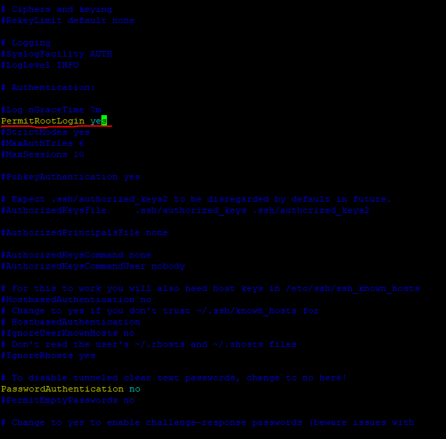  
  
처음에는 해당 부분이 # 을 통해 주석처리가 되어있을 것이다. 주석을 풀어주자.  
  
* sudo mkdir /root/.ssh  
해당 디렉토리가 없는 경우 만들어주면 된다.  
  
* sudo cp /home/ubuntu/.ssh/authorized_keys /root/.ssh  
home/ubuntu 에서 ubuntu 는 쉘 명령어 치는 왼쪽에 보면 ~@내 ip 와 같이 표기되어 있는데 
골뱅이 왼편에 있는 이름으로 디렉토리가 생성되어있을 것이다. 나는 그게 ubuntu 였고 이건 예전 블로그를 찾아봤을 때 ec2-user 로 되어있는 사람도 있었다.
어쨋든 /home/ubuntu/.ssh 경로에 있는 authorized_keys 를 위에서 만든 혹은 원래 있던 root 경로에 복사한다.  
  
* sudo systemctl restart sshd  
or  
* sudo cp /home/ubuntu/.ssh/authorized_keys /root/.ssh#sudo service sshd restart  
sshd 를 restart 한다. 이제 재접속 해보면 root 계정으로 사용가능하다.
  
#### Docker 설치
* apt-get update  
apt update 를 진행하고  
  
* apt install docker.io  
docker 를 설치해준다.  
  
* docker --version    
docker 가 잘 설치 되었는지 확인해본다.  
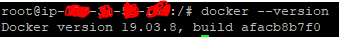  
이와 같은 방법으로 netstat(사용중인 port 확인용. 없어도 된다), java 도 설치해준다.

#### Docker 에 jenkins 설치
* docker pull jenkins/jenkins:lts    
jenkins 도커 이미지를 다운  
  
* docker run -d -p 30000:8080 --restart=always -v /var/jenkins:/var/jenkins_home -v /var/run/docker.sock:/var/run/docker.sock --name jenkins -u root jenkins/jenkins  
이후 ec2를 껐다 켰을 경우에는 docker 가 꺼져 있는 상태이다.
* systemctl start docker 를 통해 실행하면 된다.

* docker exec -i -t jenkins bash  
jenkins container 내부에 접속한다.  
    
* curl -fsSL https://get.docker.com/ | sh

jenkins container 내부에 도커 설치

그리고 ec2 http:ip:30000(위에서 포트 번호 30000으로 매핑하였으므로) 에 접속하면  
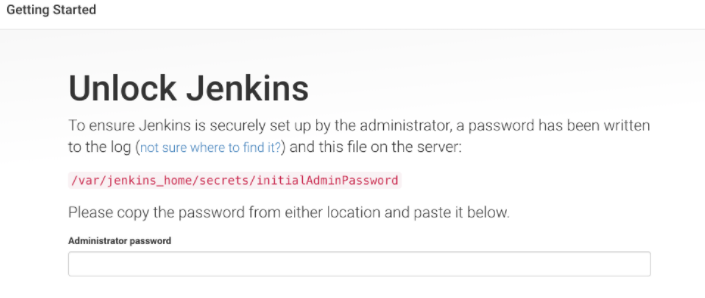  
이런 그림과 함께 비밀번호가 나와있는 경로를 알려준다. 근데 비밀번호가 있다는 경로가 존재하지 않는다. docker 이미지로 띄우면 volume 을 설정해도 안보인다...내가 못한건가 싶기도 하지만 어쨋든
나중에 디렉토리를 뒤적뒤적하다보니 var/jenkins/secret.key 가 저 비밀번호였지 않나 싶다(정확하지는 않다). 어쨋든 비밀번호를 알아내는 것은 이 방법뿐이 아니다.
  
처음에는 쉽게 찾는 방법이 docker 로그를 보면된다. 최초에 jenkins 가 올라오면서 여러가지를 초기화하고 아래와 같이 쉘에 출력해준다. 또는  
* docker logs jenkins 를 통해 확인해도 된다.
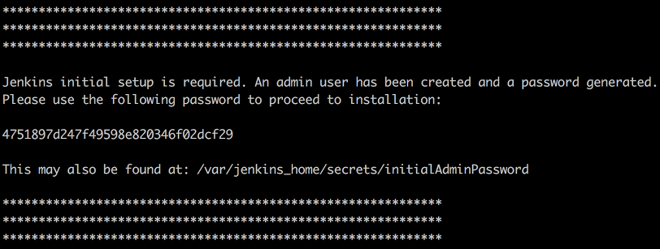  
가운데 있는 비밀번호를 복사해서 입력해준다.

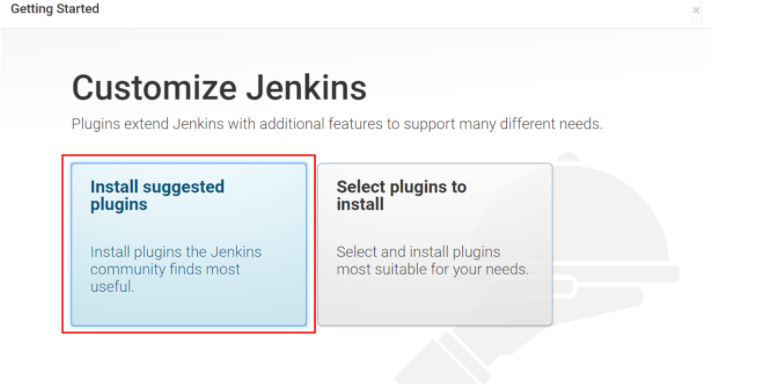  
설치 진행 완료 후 계정정보를 입력해주고 초기 설치를 마무리한다.  
  

#### Jenkins 플러그인 설치
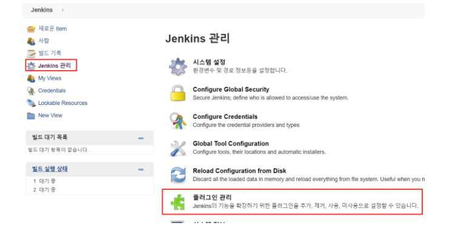  

그리고 설치 가능 목록을 누르고 검색을 통해 Publish Over SSH 를 설치해준다.  
실제로는 빌드부터 배포까지 그리고 거기에 서비스를 띄우는 경우는 거의 없다고 한다. 어떻게 활용하냐는 뭐 회사마다 프로젝트마다 다르겠지만
일반적으로는 실제 서비스되는 서버가 따로 있고 원래는 jenkins 는 jar 파일로 만들어 실제 배포되고 서비스를 띄우는 ec2 서버에 보내주면 받은 쪽에서는
jar 파일로 도커이미지를 만들고 서비스를 띄우는 식? 이 많다고 한다. publish over ssh 는 jar 파일을 만들어 보내주는 역할을 할 예정이다. 물론 우리는 
한 개의 ec2만 사용하기 때문에 같은 ec2로 보낼것이지만 말이다.

#### Github 연결
이제 jenkins 에서 본인 Github 에 있는 코드를 가지고 오기 위해 연결을 해보자.
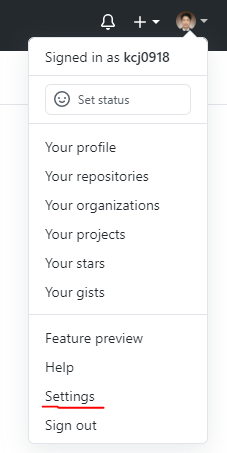  
  
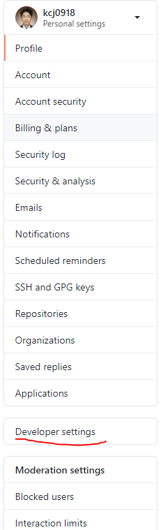  
  
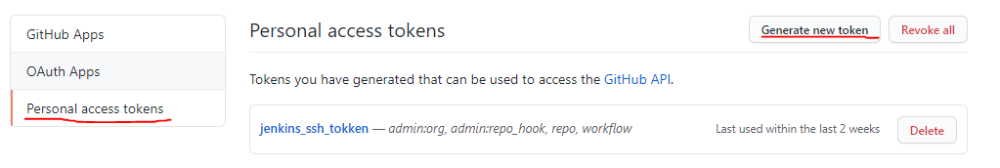  
  
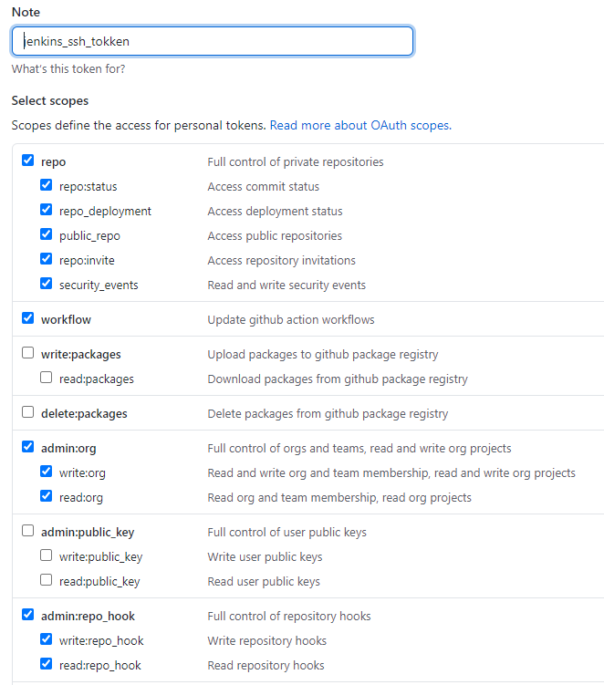  
해당 내용을 체크해주고 Generate token 해주면 token 을 발급받을 수 있다.  
  
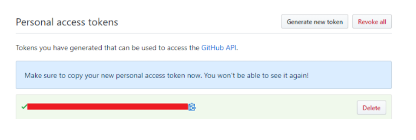  
해당 화면을 넘어가면 다시 저 access token 은 확인할 수 없으므로 주의하자. 물론 재발급 받으면 되긴하지만...  
  
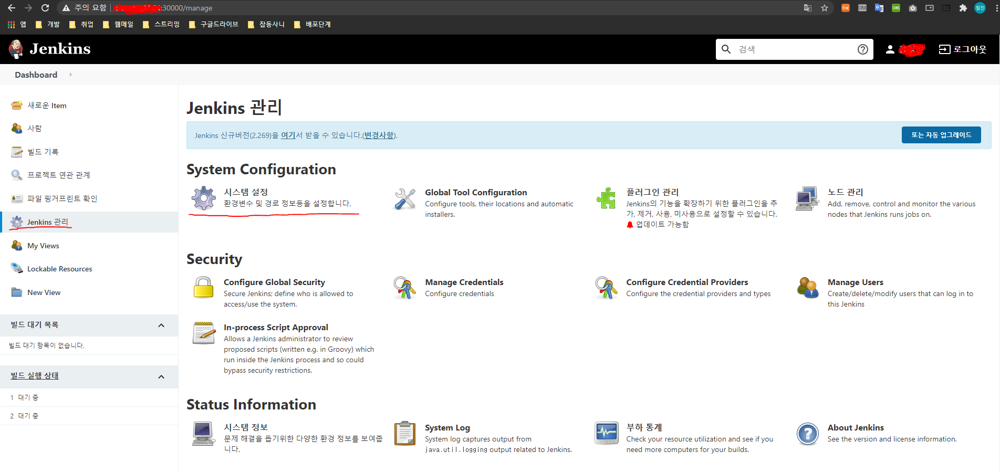  
jenkins 관리 > 시스템 설정으로 들어가준다.  
  
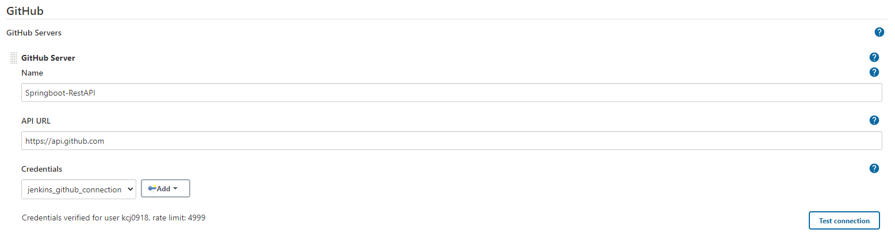  
* name 은 원하는 이름으로 지정 
* API URL : https://api.github.com  
이후 Credentials Add 를 누른다.  
  
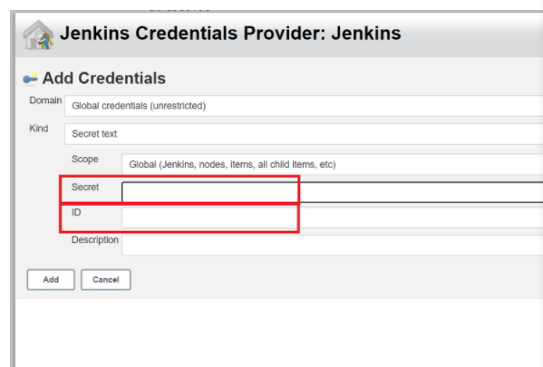  
* Domain : Global credentials (unrestricted) 선택
* Kind : Secret text 선택
* Secret : 위에서 생성한 access token 입력
* ID : 본인이 지정하는 식별자(ID) 입력  
  
이후 test connection 을 클릭해서 연동을 확인하자.  
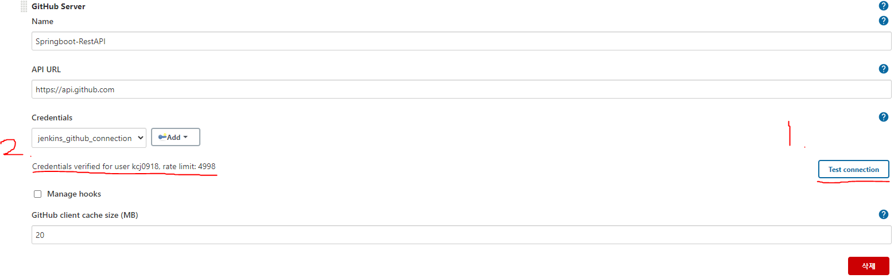  
  
#### 신규 Item 생성
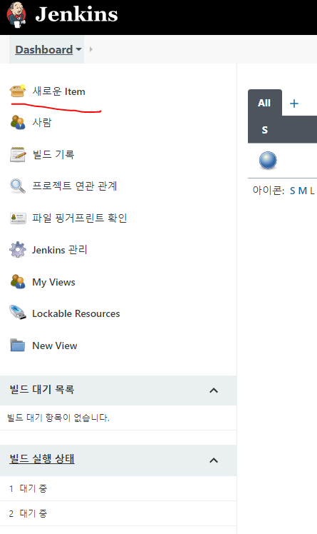  
 
  
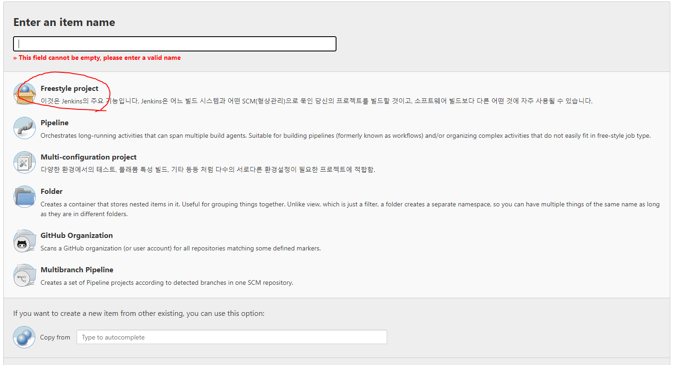  
원하는 project 명을 입력하고 > Freestyle project 클릭  
  
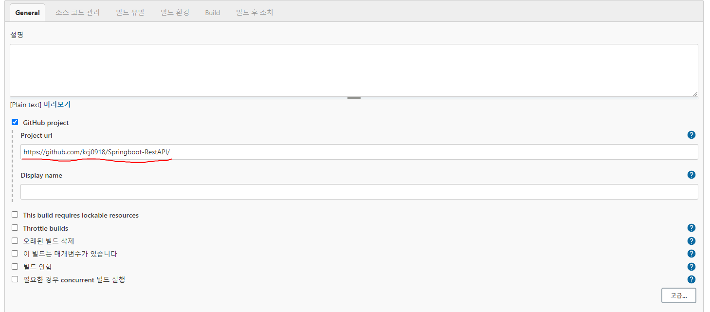  
General > github project > project url > 본인 github project url 입력  
  
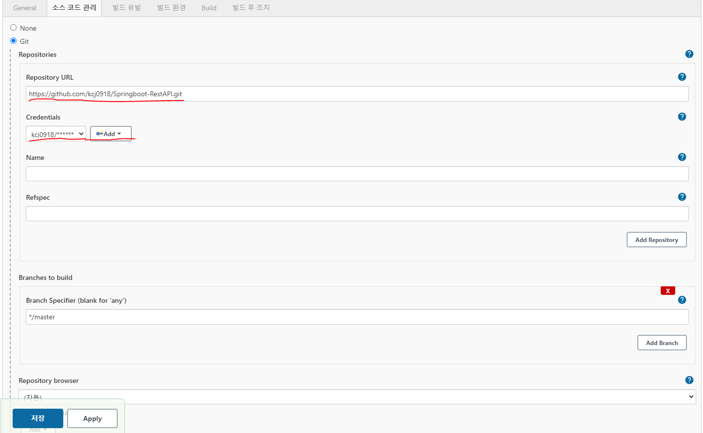  
소스코드관리 > git 클릭 > Repository Url.git 입력  
블로그에서는 미리 생성한 Credentials 를 선택할 수 있다고 하는데 왜인지 나는 뜨지 않았다.
그래서 새로 만들어주었다.  
* kind : username with password
* username : 본인 github id
* password : 본인 github password
* ID : 위처럼 본인이 원하는 id 명을 적으면 된다. Credentials name 을 적는다고 생각하자.  
  
생성한 credentials 적용해주고 
* Branch Specifier (blank for 'any') : */master (코드 가지고 올 브랜치명이다.)  
  
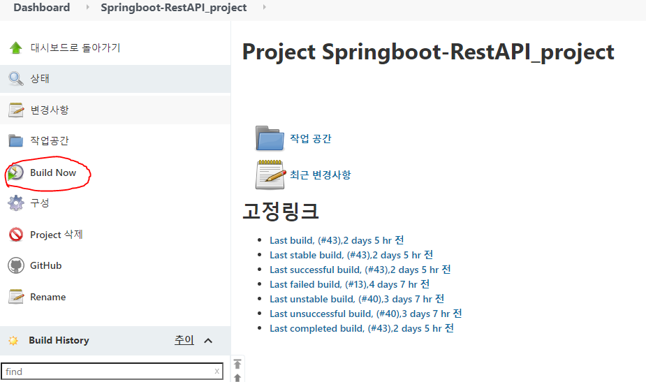
build now >> 코드를 잘 가지고 오는지 테스트 해보자.  
  
### Build, 자동화 배포
위에서 github 과 연동까지 끝마쳤다. 이제 build now 를 누르면 jar 파일을 보내주고 해당 jar 파일을 실행시켜 실제 서비스를 실제로 띄어 보는 작업을 해보겠다.  
Jenkins 설정으로 이동하여 스크롤을 내리다보면 Publish over SSH 설정하는 부분이 있을 것이다. 여기서 하고자 하는 것은 우리가 현재 젠킨스 서버와 jar 파일을 보낼 서버의 친구를 맺는 과정이라고 생각하면 되겠다.  
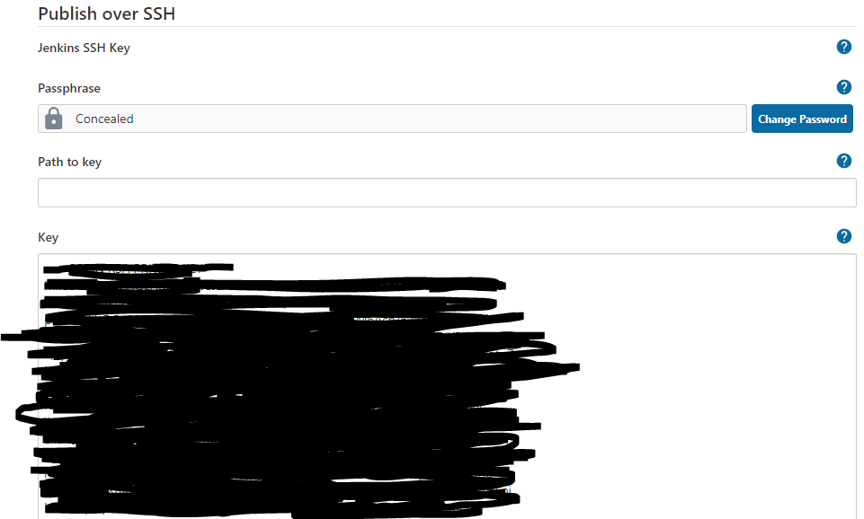  
* jenkins server
* key 에 jenkins 가 깔려있는 ec2 서버의 .pem 파일의 내용을 넣어준다.  
  
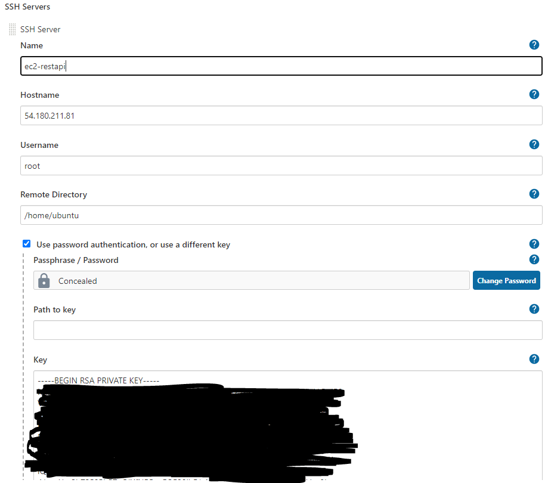
* ssh server
* name : 원하는 name  
* hostname : jar 파일을 받을 서버의 주소(우리는 그대로 받을 거기때문에 현재 ec2 주소를 적어주면 된다.)  
* Username : root
* Remote Directory : /home/ubuntu  
해당 경로를 기준으로 파일을 전송하게 될테니 잘 기억해놓자.  
아래에 Use password authentication, or use a different key 체크하자.   
* key : .pem 내용 등록(당연히 받을 ec2 서버가 다른 서버이고 다른 .pem 을 사용한다면 그 키를 등록해준다. 우리는 같으므로 위에서 적었던 내용 그대로 적어주면 되는 것)  

* 아래에 Test Configuration 버튼을 통해 테스트 해보자.

Publish over SSH 설정이 끝났다면 item 설정으로 들어가 build 탭으로 간다.  
  
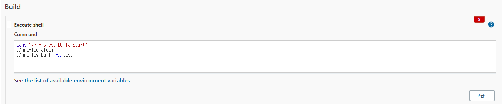  
* ./gradlew clean
* ./gradlew build -x test  (-x text 는 test 코드는 스킵하겠다는 것)
여기서 권한 문제가 발생한다면 실제 local project 로 가서 권한을 줘야한다.  
  
다음은 다른 서버로 빌드된 jar 파일을 던질 때 해야 하는 설정이다. 물론 우리는 다른 서버인척이지만 어쨋든 여기서는 조금 집중하자 잘못하면 이 부분에서 진짜 삽질 겁나게 한다.
  
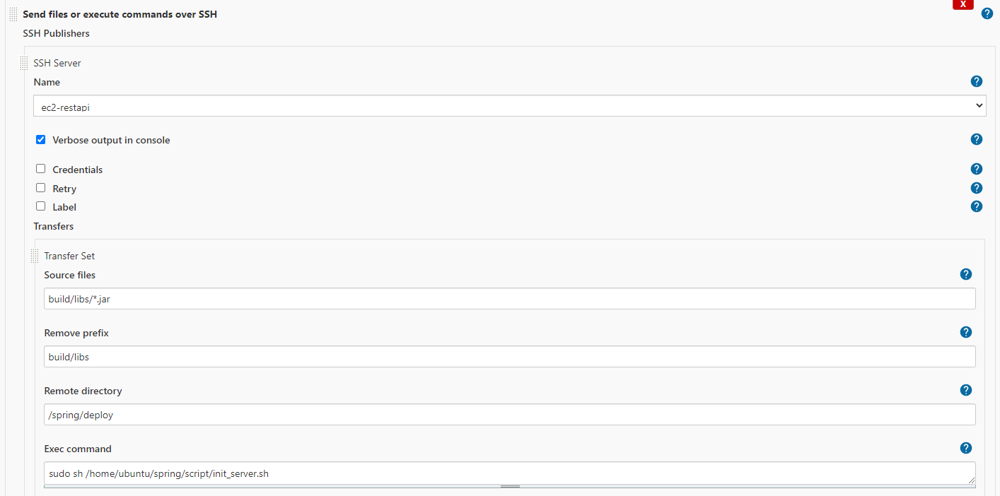  
Build > Send files or execute commands over ssh 선택한다.  
* Name : 원하는 name 지정  
여기서 name 아래쪽에 고급탭이 있을텐데 열어서 첫 번째 Verbose output in console
 부분을 체크해주자. 그래야 에러가 나더라도 자세한 메세지를 볼 수 있다.  
* Source file : build/libs/*.jar  
내가 전송할 파일의 위치를 적는 부분이다. 젠킨스 workspace 기준으로 적게 되는데 git pull 로 당겨 온
스프링 부트 앱의 루트 경로라고 생각해도 된다. 그럼 Gradle build 시 jar 파일의 위치는 build/libs 안에 들어가 있다.
그곳의 jar 파일이라고 명시를 해주는 부분이다.  
* Remove prefix : build/libs  
* Remote Directory : spring/deploy  
파일을 전송할 원격 서버의 Directory 를 명시하는 부분이다. 이 부분을 조심해야한다. 위에서 우리는 젠킨스서버와 jar 파일을 보낼 서버와 친구를 맺었는데 거기서 설정한 폴더 기준으로 적어야한다. 
그 쪽에서 /home/ubuntu 라고 적었기 때문에 그 다음 경로를 적어준다. 위에서는 /spring/deploy 라고 되어있다. 여기 deploy 라는 폴더에 jar 파일을 넣으려고 한다. 그래서 미리 저 폴더는 서버에 들어가 미리 만들어 놓아야 한다.
아래 사진을 통해 조금 더 폴더 구조를 쉽게 보자.  
  
  
원격 서버의 폴더 구조이다. 우리가 전송할 경로는 ubuntu/spring/deploy 이다.  

* Exec command : sudo sh /home/ubuntu/spring/script/init_server.sh  
파일 전송 후 실행할 명령어를 입력한다. 당연히 서버에 미리 저 스크립트 파일이 있어야 하겠다. script 내용을 살펴보자.
  
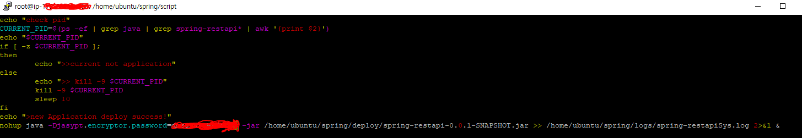  
가장 아래줄을 제외하면 크게 신경쓰지 않아도 된다. 젠킨스에서 메세지를 보기 위함이고 
가장 아래쪽에 해당하는 줄은 백그라운드로 실행하겠다는 의미이며 여기서 필요한 jvm 옵션이 있다면 넣어서 실행하면 되겠다.
우리는 서비스는 지금 Properties 파일이 암호화 되어 있기때문에 그 암호화를 풀기위한 jvm 옵션을 준것이고 이렇게 관련 로그도 파일로 만들어 따로 관리하는 폴더에 넣어주었다. 로그 파일은 크게 중요한 것이 아니니 넘어가도 된다.  
  
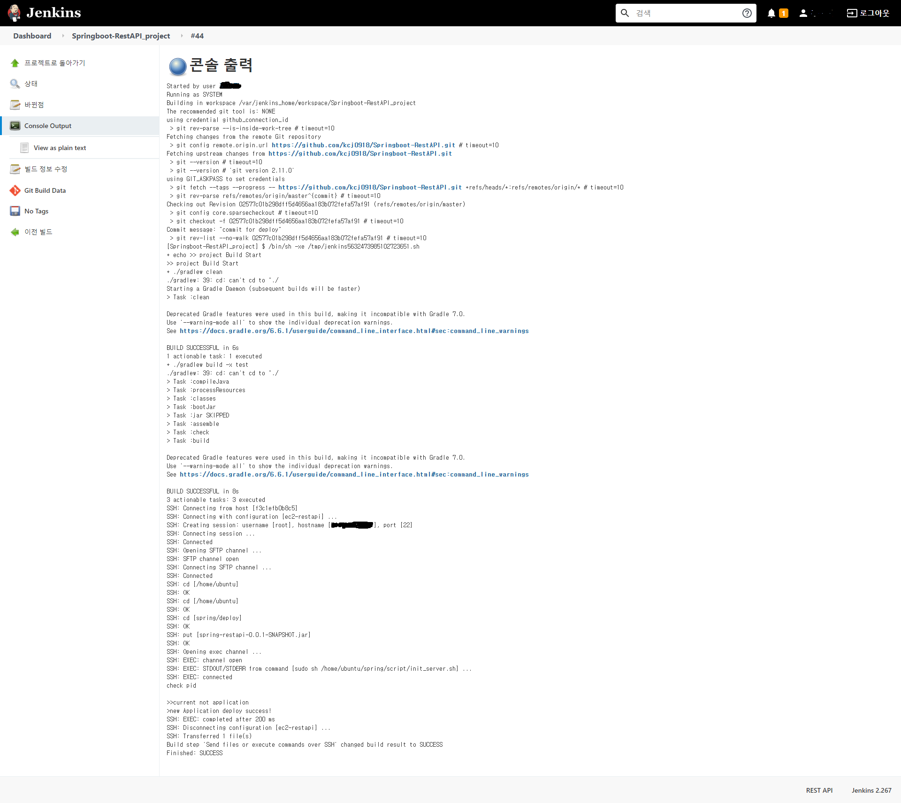  
이러면 끝이다. 이제 실제로 잘 서비스가 띄어졌는지 확인해보자.

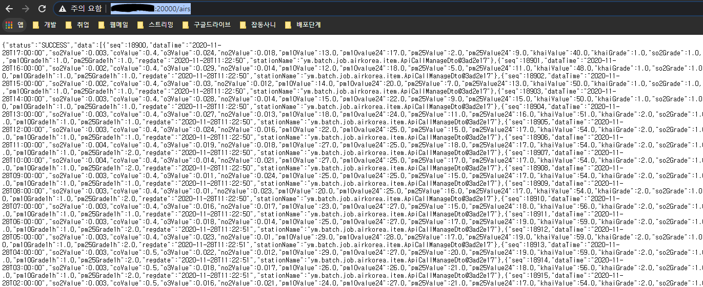  

 
  

 

 

