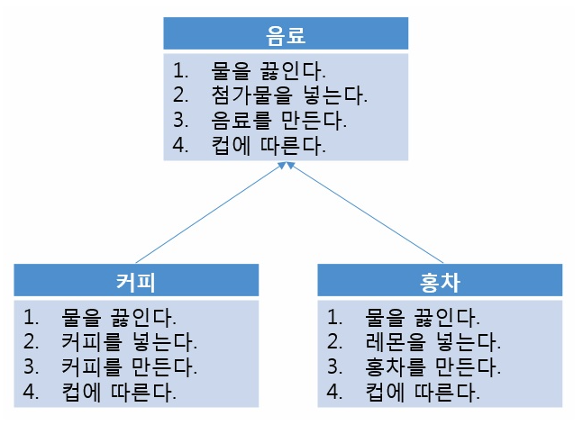
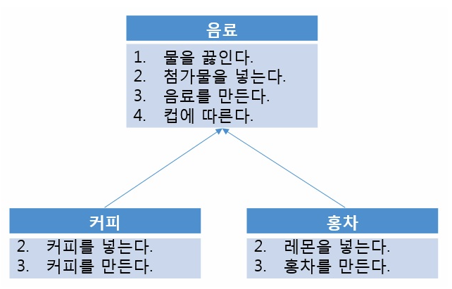

# Design pattern

**:Contents**
* [템플렛 메서드 패턴](#템플렛_메서드_패턴)
* [팩토리 패턴](#팩토리_패턴)
* [전략 패턴](#전략_패턴)
* [프록시 패턴](#프록시_패턴)
* [싱글톤 패턴](#싱글톤_패턴)
* [어댑터 패턴](#어댑터_패턴)
* [데코레이션 패턴](#데코레이션_패턴)

---


### 템플렛_메서드_패턴

* 템플렛_메서드_패턴이란

토비의 스프링에서는 아래와 같이 정의하고 있다.
>> 상속을 통해 슈퍼클래스의 기능을 확장할 때 사용하는 가장 대표적인 방법.<br>
 변하지 않는 기능은 슈퍼클래스에 만들어두고 자주 변경되며 확장할 기능은 서브클래스에서 만들도록 한다
 

아래의 예시의 생활에서 익숙한 예시이다.<br>




위의 구조를 아래의 구조와 같이 변경하는 것이 템플릿 메서드 패턴이다.<br>
공통된 기능은 그대로 사용하고 확장된 기능은 서브클래스에서 구현해주면 된다.





코드로 보면 아래와 같다.<br>
위에 음료에 대한 예시가 아닌 실제 자주 사용하는 코드에 대한 예시입니다.


`슈퍼 클래스`

```java

public abstract class AbstractCallTemplate{

    @Override
    public Map<String, Object> apiGetCall(String url) {
        RestTemplate restTemplate = new RestTemplate();
        HttpHeaders httpHeaders = new HttpHeaders();
        httpHeaders.setContentType(new MediaType("application", "json", Charset.forName("UTF-8")));
        Map<String, Object> response = restTemplate.getForObject(url, Map.class);
        return response;
    }

    public abstract String urlMake(Map<String, Object> params);

}

```

각 API호출시 request값들은 다르겠지만 api 호출은 동일하다.<br>
그래서 api호출을 하는 apiGetCall() 메서드는 추상클래스에 구현하여 사용하며 상황별로 다를 수 있는 request값들은 서블클래스에서 구현해 준다.<br>

`서브 클래스`

```java

@Component
public class SkeletonClient  extends AbstractCallTemplate {
    private final static Logger LOGGER = LoggerFactory.getLogger(SkeletonClient.class);
    private final static String RESOURCE = "http://api.corona-19.kr/korea/country/new/?";

    @Override
    public String urlMake(Map<String, Object> params) {
        String callUrl = "";
        if(!params.isEmpty()){
            callUrl = RESOURCE +"serviceKey="+ params.get("serviceKey");
        }
        return callUrl;
    }
}

```

`사용 클래스`


```java
@Component
public class SkeletonResponse {
    private final static Logger LOGGER = LoggerFactory.getLogger(SkeletonResponse.class);

    @Autowired
    private SkeletonClient skeletonClient;


    @Cacheable(value = "getSkeletonList" , keyGenerator = "skeletonKeyGenerator")
    public Map<String, Object> getList(){
        Map<String, Object> params = new HashMap<>();
        params.put("serviceKey","111111");
        String callUrl = skeletonClient.urlMake(params);
        Map<String, Object> lists = ists = skeletonClient.apiGetCall(callUrl);

        return lists;
    }
}
```


java8이상부터라면 인터페이스를 사용해도 될거 같은데 정리가 잘 된 사아트가 았어 남겨놨습니다.(아래의 출저 사이트를 참)


`출저`
https://yaboong.github.io/design-pattern/2018/09/27/template-method-pattern/


### 팩토리_패턴

객체를 생성하는 작업을 한 클래스에 캡슐화시켜 놓은 방식입니다.

* 구현을 변경해야 하는 경우에 여기저기 흩어져 있는 소스를 고칠 필요없이 팩토리 클래스만 수정하면 된다.

* 중복된 코드 제거


`생성해야 하는 객체 SkeletonClient , DemoClient`


```java

@Component
public class DemoClient extends AbstractCallTemplate {
    private final static String RESOURCE = "RESOURCE";

    @Override
    public String urlMake(Map<String, Object> params) {
        String callUrl = "";
        if(!params.isEmpty()){
            callUrl = RESOURCE;
        }
        return callUrl;
    }
}

```


```java

@Component
public class SkeletonClient  extends AbstractCallTemplate {
    private final static Logger LOGGER = LoggerFactory.getLogger(SkeletonClient.class);
    private final static String RESOURCE = "http://api.corona-19.kr/korea/country/new/?";

    @Override
    public String urlMake(Map<String, Object> params) {
        String callUrl = "";
        if(!params.isEmpty()){
            callUrl = RESOURCE +"serviceKey="+ params.get("serviceKey");
        }
        return callUrl;
    }
}

```

`객체 생성을 책임지는 factory class`

```java

@Service
public class ClientFactory {

    @Autowired
    @Qualifier("skeletonClient")
    private AbstractCallTemplate skeletonClient;

    @Autowired
    @Qualifier("demoClient")
    private AbstractCallTemplate demoClient;

    public AbstractCallTemplate getClient(String apiType){
        AbstractCallTemplate ret = null;
        switch (apiType){
            case "DM":
                ret = demoClient;
                break;
            case "ST":
                ret = skeletonClient;
                break;
            default:
                break;
        }

        return  Optional.ofNullable(ret)
                    .orElseThrow(() -> new NoSuchElementException(apiType+"에 해당하는 객체를 찾을 수 없습니다."));

    }
}


```


`factory를 통해 객체를 생성하 class`


```java

@Component
public class SkeletonResponse {
    private final static Logger LOGGER = LoggerFactory.getLogger(SkeletonResponse.class);

    @Autowired
    private ClientFactory clientFactory;


    @Cacheable(value = "getSkeletonList" , keyGenerator = "skeletonKeyGenerator")
    public Map<String, Object> getList(){
        AbstractCallTemplate client = clientFactory.getClient(ApiType.SKELETON_TYPE.getApiTypeCode());
        Map<String, Object> params = new HashMap<>();
        params.put("serviceKey","");

        String callUrl = client.urlMake(params);
        Map<String, Object> lists = client.apiGetCall(callUrl);

        return lists;
    }
}

```


