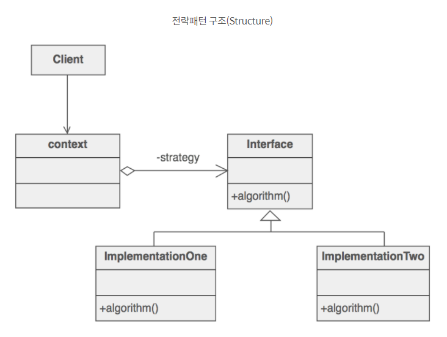
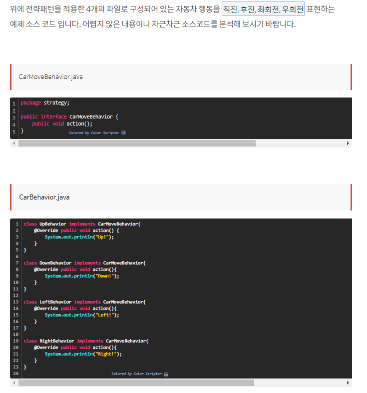
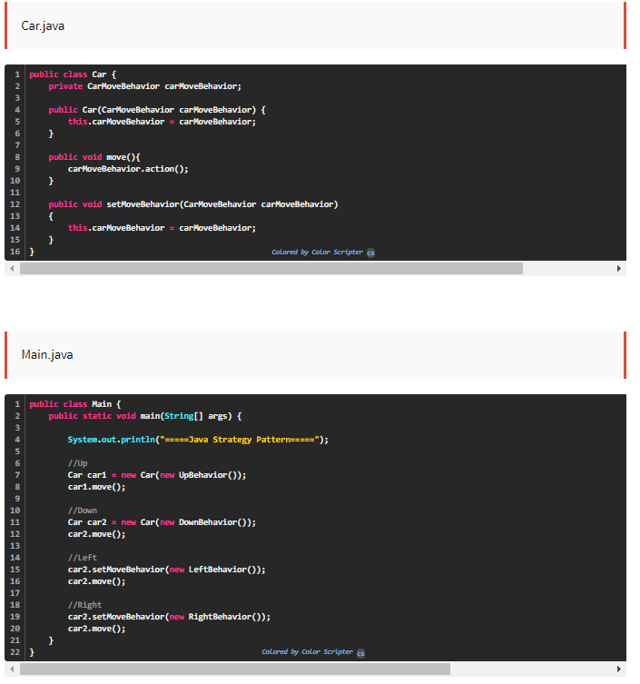
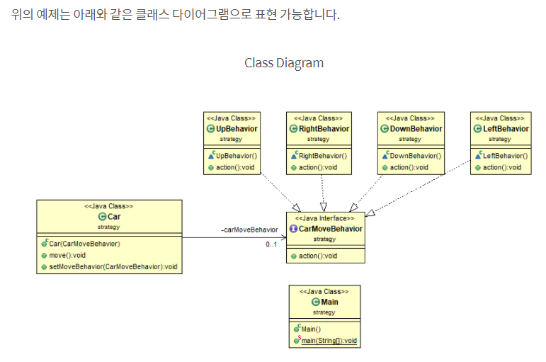
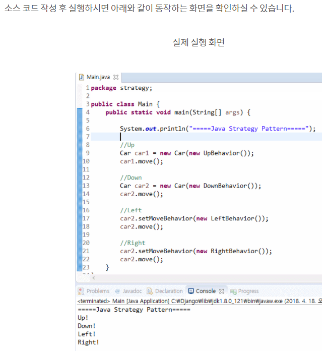
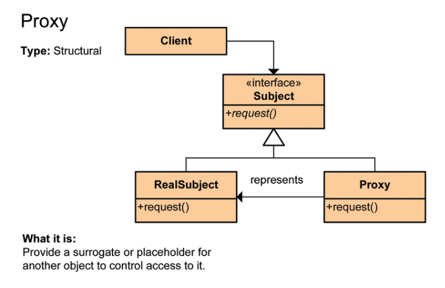
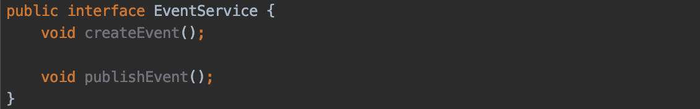
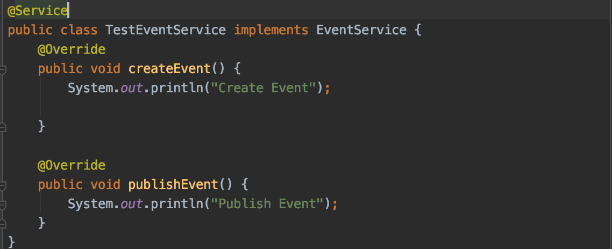
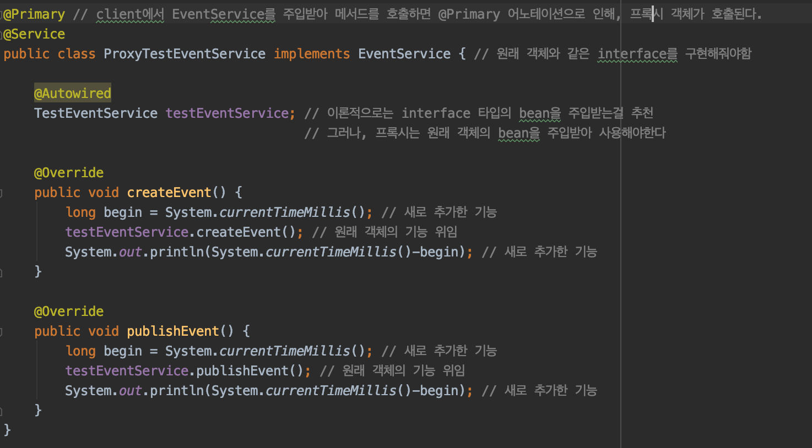

# Design pattern

**:Contents**
* [템플렛 메서드 패턴](#템플렛_메서드_패턴)
* [팩토리 메서드 패턴](#팩토리_메서드_패턴)
* [전략 패턴](#전략_패턴)
* [프록시 패턴](#프록시_패턴)
* [싱글톤 패턴](#싱글톤_패턴)
* [어댑터 패턴](#어댑터_패턴)
* [데코레이션 패턴](#데코레이션_패턴)

---

### 전략 패턴
#### 전략 패턴이란?
- 전략패턴은 각각의 알고리즘군을 교환이 가능하도록 별도로 정의하고 각각 캡슐화 한 후 서로 교환해서 사용할 수 있는 패턴이며, 아래와 같은 장점이 있습니다.
>- 코드 중복 방지
>- 런타임(Runtime)시에 타겟 메소드 변경
>- 확장성(신규 클래스) 및 알고리즘 변경 용이

- 알고리즘군을 정의하고 각각을 켑슐화하여 교환해서 사용할 수 있도록 만드는 방식
- Strategy 패턴을 활용하면 알고리즘을 사용하는 클라이언트와는 독립적으로 알고리즘을 변경할 수 있다.
- 즉 알고리즘의 인터페이스(API) 부분만 규정해서 변경해서 사용할 수 있도록 하는 것을 전략 패턴[행동 자체를 구현이 아닌 inteface(API)로 정의해 사용하는 방식]이라 한다.

#### JAVA 전략 패턴 구조 
  
- Strategy(전략) : 전략 사용을 위한 인터페이스 생성
- ImplementationOne, ImplementationTwo : Strategy 인터페이스를 구현한 실제 알고리즘을 구현
- Context : 인스턴스를 주입받아 직접 사용하는 역할

#### JAVA 전략 패턴 -예제 소스 코드 
  
  

#### JAVA 전략 패턴 -클래스 다이어그램(UML) 및 예제 실행
  

  

##### cf) ** 전략 패턴과 템플릿 메소드 패턴
>- 전략패턴은 템플릿 메소드 패턴과 유사할 겁니다.    
>  템플릿 메소드 패턴은 반드시 추상 클래스의 템플릿 메서드에서 구현클래스의 메서드를 부르는 식으로 로직을 구성해야 합니다[(상위->하위)]    
   상속을 이용하는 템플릿 메서드 패턴과 객체주입을 통한 전략패턴 중에서 고민해보고 적용하면 됩니다.    
   단일 상속만이 가능한 자바에서 상속이라는 제한이 있는 템플릿 메서드 패턴보다는 다양하게 많은 전략을 implements할 수 있는 전략패턴이 많이 사용됩니다.    
   전략 패턴을 한마디로 정리하면, "클라이언트가 전략을 생성해 전략을 실행할 컨텍스트에게 주입하는 패턴이다."

- Strategy 패턴: 알고리즘을 구성으로 사용.유연성 o
- Template Method 패턴: 알고리즘을 서브클래스[하위]에서 일부 지정할 수 있으면서 재사용이 가능, 하지만 의존성이 크다는 문제가 발생. 재사용 o

>출처 : https://niceman.tistory.com/133

##### cf) 캡슐화    
>- 객체의 필드(속성), 메소드를 하나로 묶고, 실제 구현 내용을 외부에 감추는 것을 말한다.
>- 외부 객체는 객체 내부의 구조를 얻지 못하며 객체가 노출해서 제공하는 필드와 메소드만 이용할 수 있다.
>- 필드와 메소드를 캡슐화하여 보호하는 이유는 외부의 잘못된 사용으로 인해 객체가 손상되지 않도록 하는데 있다.
>- 자바 언어는 캡슐화된 멤버를 노출시킬 것인지 숨길 것인지를 결정하기 위해 접근 제한자(Access Modifier)를 사용한다.

------------------------------------------------

###프록시 패턴
프록시(Proxy)는 우리 말로 대리자, 대변인이라는 뜻을 가지고 있다. 대리자 대변인은 다른 누군가를 대신해 그 역할을 수행하는 존재이다.
프로그램에서 봤을 때도 같은 맥락이다. 프록시는 어떤 일을 대신시키는 것이고 구체적으로 인터페이스를 사용하고 실행시킬 클래스에 대한 객체가 들어갈 자리에
대리자 객체, 그러니까 프록시 객체를 대신 투입해 클라이언트 쪽에서 요청했을 때 바로 그 객체에 대한 처리를 하는 것이 아니라 대리자 객체를 통해 메서드를 호출하고
반환 해주는 역할을 합니다.  

  
프록시는 일종의 비서역할을 한다고 생각하면 된다. 실제 작업을 하는 Object 를 감싸서, 실제 Object 를 요청하기 전이나 후에 인가처리(보호), 생성 자원이 많이 드는 작업에 대해
백그라운드 처리(가상), 원격 메서드를 호출하기 위한 작업(원격) 등을 하는데 사용한다.  
  
중요한 것은 프록시는 흐름제어만 할 뿐 결과 값을 조작하거나 변경시키면 안된다는 것이다. 우리가 비서에게 대신 연락처 목록을 정리해서 달라고 지시했다면, 그 연락처 목록을 정리한 결과를 줘야하지,
비서가 마음대로 그 연락처를 수정하거나 하면 안되는 것처럼 말이다.

프록시를 UML 로 표현하면 다음과 같다.

  
  
>출처 : https://limkydev.tistory.com/79

클라이언트가 어떤 일에 대한 요청(RealSubject 의 request() 메서드 호출)을 하면, Proxy 가 대신 RealSubject 의 request() 메서드 호출을 하고 그 반환 값을 클라이언트에 전달한다.  
  
코드로 나타내면 다음과 같다.  
  

  

  
  

  
>출처 : https://velog.io/@max9106/Spring-%ED%94%84%EB%A1%9D%EC%8B%9C-AOP-xwk5zy57ee
  

이렇게 프록시가 실제 서비스 클래스의 메서드를 호출하여 반환해주는 것을 볼 수 있다. 또한 또 다른 로직 처리를 해줄 수도 있다. 이러한 프록시 패턴을 보면 Spring AOP 에 대해 말하지 않을 수 없다.
위처럼 프록시 클래스를 따로 두고 @Primary 어노테이션을 통해 프록시 패턴을 사용하면 원래 서비스 클래스에 코드를 추가하지 않고도 다른 기능을 넣어줄 수 있지만, 중복 코드가 발생할 수 있고,
다른 클래스에서도 동일한 기능을 사용하고자 한다면, 그 또한 매번 코딩을 해줘야하는 점에서 효율적이지 못하다.  
  
이러한 문제를 해결해 주는 것이 스프링 AOP 이다. AOP 는 @Aspect 어노테이션을 통해 만들수 있다. 또한 @Around, @Before, @After 등의 어노테이션을 통해 해당 함수들의
전, 후의 실행시점을 자유롭게 설정해줄 수 있다. 그래서 일반적으로 로깅, 트랜잭션과 같은 처리를 AOP 를 활용하는 경우가 많다.  
  
어쨋든 AOP 를 설명하고자 하는 것은 아니기에 AOP 에 대해 더 궁금하다면 직접 찾아보도록 하고, 끝으로
프록시 패턴은 정말 많은 곳에서 사용되고 있고 응용할 곳도 많은 패턴인 듯 하니 숙지하고 있는 것이 좋은 패턴인듯 하다.

