# OS

**:Contents**
* lru 알고리즘(#LRU알고리즘이란)
* 프로세스와 스레드의 차이(Process vs Thread)
* 멀티 프로세스 대신 멀티 스레드를 사용하는 이유
* Thread-safe
* 동기화 객체의 종류
* 뮤텍스와 세마포어의 차이
* 스케줄러
* 동기와 비동기
* 프로세스 동기화
* 메모리 관리 전략
* 가상 메모리
* 캐시의 지역성
* 교착상태(데드락, Deadlock)의 개념과 조건
* 사용자 수준 스레드와 커널 수준 스레드
* 외부 단편화와 내부 단편화
* Context Switching
* Swapping

---

### LRU알고리즘이란  Least-Recently-Used

페이지 교체 알고리즘 중에 하나이다.
메모리에 빈 프레임이 없을 때 적재될 페이지를 위해 적재된 페이지 중 누군가는
자신이 차지한 프레임을 비워주어야 하는 교체 대상이 되어야 한다.
어떤 페이지를 선택하는 것이 최적의 기법이 인지 판단하는 다양한 기법들이 있고 페이지 교체 알고리즘이라고 한다.

LRU알고리즘은 `최근에 사용하지 않는 페이지를 가장 먼저 내려 보내는 알고리즘`이다.

`LRU알고리즘 예제` 

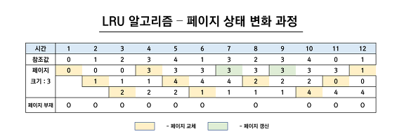

* 페이지 크기가 3이라고 가정하고 0 부터 4 까지의 숫자들이 참조되는 경우를 그린 LRU 알고리즘의 상태 변화과정을 나타낸 표
* 황색 표시는 페이지가 교체 되는 상황이고 연두색은 페이지에 데이터가 존재하여 갱신되는 경우

1).시간1-6까지는 최근에 사용하지 않는 페이지를 내보내고 페이지 교체한다.
2).시간7인 경우에는 cache hit => 3
3).시간8인 경우 최근에 사용하지 않는 참조값 4를 가진 2번째 페이지 교체
4).시간9에서 다시 cache hit => 3

---

### 프로세스와 스레드의 차이(Process vs Thread)
#### 프로세스
`프로세스의 구성` 
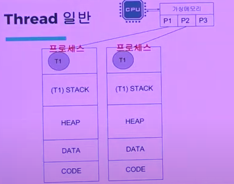

* 프로세스 : 스레드 + 메모리공간(stack, code , data , heap)
* 실행중인 프로그램이다.
ex) spring boot application

[cpu 를!]
OS의 스케줄러애 의해 time slice만큼 실행

[memory 를!]
OS로 할당받은 메모리 공간 사용
code , data , heap , stack

`프로세스의 특징` 
cpu는 가상메모리를 통해 Ram주소를 들어간다.

가상메모리는 일종의 프로세스를 가리키는 페이징 테이블이라고 한다.
프로세스간 메모리 공간격리

가상메모리는 프로세스간 주소공간을 논리적으로 차단한다.

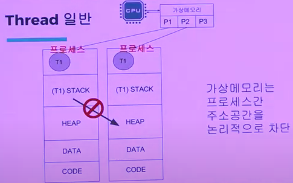

`T1 ,T2 == task_struct` 

task_struct는 커널의 중요한 객체이며 실행중인 프로그램인 프로세스는 리눅스에서는 테스크(task)와 동일한 의미로 사용된다.
프로세스는 파일 시스템에서 메모리로 로드한 코드, 데이터(프로그램)와 이를 커널에서 관리하기 위한 task_struct 구조체이다.

정리하자면 프로세스는 task_struct구조체를 통해 스레드라는 자원을 관리한다. 

#### 스레드
* 프로세스를 만드는 것보다 비용이 저렴
* 스레드들간 HEAP 메모리 공간 공유
* 하나의 프로세스에 하나의 스레드가 있는 상황에서 신규 스레드가 추가된다면 신규 스레드가 사용할 stack 메모리 공간만
생성된다.

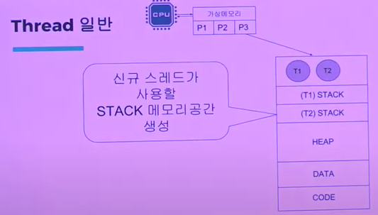

---

### 멀티 프로세스 대신 멀티 스레드를 사용하는 이유

[리눅스기준]
#### 스레드의 생성의 비용이 더 저렴하다.

#### context switch 비용

cpu와 LAM 영역 사이에 메모리 인풋 아웃 IO작업이 일어나는데
LAM 영역에 접근하는데 많이 시간이 걸린다.

스레드의 경우 HEAP 메모리 영역을 공유하므로 한 프로세스안에 다른 스레드들이 context switch이
일어나도 캐시에 같이 데이터가 있을 수 있기 때문에

캐싱 측면에서 스레드 모델 성능이 좋다.

멀티 프로세스 모델은 서로간 메모리를 공유 할 수 없기 때문에 
context switch시 캐시 레이어를 리셋해버린다.
그렇기 때문에 속도적으로 이슈가 생긴다.

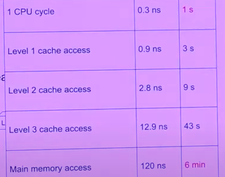

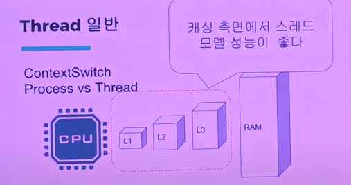

---

### Thread-safe
* 멀티 스레드 프로그래밍에서 함수, 변수, 객체 등이 여러 스레드로부터 동시에 접근이 이루어져도
프로그램의 실행에 문제가 없다는 것을 뜻한다.   
* 하나의 함수가 한 Thread로부터 호출되어 실행 중일 때
다른 Thread가 그 함수를 호출하여 동시에 함께 실행되더라도 각 스레드에서의 함수의 수행 결과가 의도한대로 나와야합니다.

* Thread-safe를 지키기 위한 방법
    1. Re-entrancy : 어떤 함수가 한 스레드에 의해 호출되어 실행 중일 때, 
    다른 스레드가 그 함수를 호출하더라도 그 결과가 각각에게 올바로 주어져야 한다.
    2. Thread-local storage : 공유 자원의 사용을 최대한 줄여 각각의 스레드에서만 접근 가능한 저장소들을 사용함으로써 동시 접근을 막는다.
    이 방식은 동기화 방법과 관련되어 있고, 또한 공유상태를 피할 수 없을 때 사용하는 방식이다.
    3. Mutual exclusion : 공유 자원을 꼭 사용해야 할 경우 해당 자원의 접근을 세마포어 등의 락으로 통제한다.
    4. Atomic operations : 공유 자원에 접근할 때 원자 연산을 이용하거나 '원자적'으로 정의된 접근 방법을 사용함으로써 상호 배제를 구현할 수 있다.
 
* Thread Safe한 코드 작성하기
    1. Synchronized 함수 사용    
    -클래스로 만들어진 하나의 인스턴스를 기준으로 동기화가 이루어진다.
    2. Synchronized 블럭 사용    
    -전달받은 객체를 기준으로 동기화가 이루어진다. 
    3. ReentrantLock 사용    
    -시작점과 끝점을 명백히 명시할 수 있다. Synchronized는 암묵적이고 ReentrantLock는 명시적이라는 차이가 있다.
    4. 세마포어 사용    
    -하나의 스레드만 임계구역에 들어가면 성능 이슈가 발생하는데, 세마포어는 임계구역에 여러 스레드가 들어갈 수 있는 장점이 있다.
     공유자원이 2개 이상일 때 잘못 사용하면 서로 자원을 점유하기 위해서 대기상태에 빠지므로 DeadLock이 발생할 수 있다.
    5. 모니터 사용    
    -모니터는 2개의 Queue가 존재한다.     
     하나의 Queue는 하나의 Thread만 공유자원에 접근할 수 있게하는 역할을 한다.(상호배타)     
     다른 Queue는 임계구역에 진입한 wait()을 통해 Thread가 블락되면 새로운 Thread가 진입할 수 있도록 알려주는 역할을 한다.(조건동기)     
     그리고 새로 진입한 Thread가 notify()를 통해 블락된 Thread를 재진입할 수 있도록 하는 역할도 한다.(조건동기)    
     *cf ) 임계 구역 : 파일, 입출력, 공유 데이터 등 원자적으로 실행할 필요가 있는 명령문 또는 코드의 일부 영역
     * cf Link ) [Thread-safe을 위한 방법](https://www.goozy.net/6)
---     
### 동기화 객체의 종류 
#### Critical section 이란 ?
* 동기화 방법 중 유일하게 커널 객체를사용하지 않으며 그 내부 구조가 단순하기 때문에 동기화 처리를 하는 데 있어서 속도가 빠르다는 장점이 있으며 동일한 프로세스내에서만 사용할 수 있다는 제약이 있다.    
* 크리티컬 섹션은 커널 객체를 사용하지 않기 때문에 핸들을 사용하지 않고 대신 CRITICAL_SECTION라는 타입을 정의하여 사용하게 되며, 아래 4가지 Win32 API를 사용하여 동기화를 수행하게 된다.    
    * VOID InitializeCriticalSection(LRCRITICAL_SECTION IpCriticalSection);
      VOID DeleteCriticalSection(LRCRITICAL_SECTION IpCriticalSection);
      VOID EnterCriticalSection(LRCRITICAL_SECTION IpCriticalSection);
      VOID LeaveCriticalSection(LRCRITICAL_SECTION IpCriticalSection);

* ★★★ 공유 데이타를 여러 프로세스가 동시에 액세스하면 시간적인 차이 때문에 잘못된 결과를 만들어 낼 수 있기 때문에 한 프로세스가 위험 부분을 수행하고 있을 때, 즉 공유 데이타를 액세스하고 있을 때는 다른 프로세스들은 절대로 그 데이타를 액세스하지 못하도록 하여야 한다.
* ※ 커널 객체를 사용하지 않는 동기화 객체는 크리티컬 섹션뿐이며 뮤택스를 포함한 동기화 객체들, 스레드(Thread), 파일(File)들까지도 동기화를 위한 커널 객체를 포함하고 있다.

#### 이벤트란(Event)?
* 이벤트는 어떠한 사건에 대하여 알리기 위한 용도로 사용되는 동기화 객체이다. 이벤트 객체의 경우 우리가
Windows에서 메시지를 교환할 때 사용하는 개념과 같은 개념이다. 즉, Windows의 메시지 교환 방식은 이벤트에
기반한 방식이라고 이야기한다. 키보드가 눌려질 경우 WM_KEYDOWN, 마우스 왼쪽 버튼이 눌러질 경우
WM_LBUTTONDOWN과 같은 메시지가 날라오며, 이러한 신호는 이벤트를 통하여 통보하게 되는 것이다.
* 이벤트의 경우 SetEvent() 또는 ResetEvent()를 사용하여 동기화 객체들의 상태를 마음대로 바꿀 수 있게 된다.

#### 뮤텍스란(Mutex)? 
* 공유된 자원의 데이터를 여러 쓰레드가 접근하는 것을 막는 것
* Mutual Exclusion 으로 상호배제라고도 한다. 
 Critical Section을 가진 쓰레드들의 Runnig Time이 서로 겹치지 않게 각각 단독으로 실행되게 하는 기술입니다. 다중 프로세스들의 공유 리소스에 대한 접근을 조율하기 위해 locking과 unlocking을 사용한다. 
 즉, 쉽게 말하면 뮤텍스 객체를 두 쓰레드가 동시에 사용할 수 없다는 의미입니다.    
* 뮤텍스는 스레드가 여러 개 있더라도 자신이 소유한 스레드가 누구인지를 기억하고 있으며, Windows 운영체제는 뮤텍스가 반환되지 않은 상태에서 스레드가 종료될 경우 그 뮤텍스를 강제적으로 Signaled 해줌으로써 이를 대기하고 있던 스레드가 무한정 기다리는 일이 없도록 해준다.    
* 뮤텍스는 뮤텍스를 소유한 스레드를 기억하고 있음으로써 같은 스레드가 같은 뮤텍스를 중복 호출하더라도 데드락 현상이 발생하기 않게 하고있다.    
즉, 내부적으로 같은 스레드가 같은 뮤텍스를 소유하려 할 경우 뮤텍스의 내부적인 카운트만을 증가시켜 주고 이 스레드에 대한 진입은 허용하여 주게 된다.     
그리고 이 내부적인 카운트가 0으로 내려갔을 경우에 Signaled 상태로 돌려줌으로써 다른 스레드에 대해서는 중복 호출한 스레드가 뮤텍스에 대한 사용을 모두 종료한 후에 진입하도록 하고 있으며, 이러한 기능은 같은 스레드의 재귀 호출에 의한 데드락 현상을 방지하여 주게 된다.
  
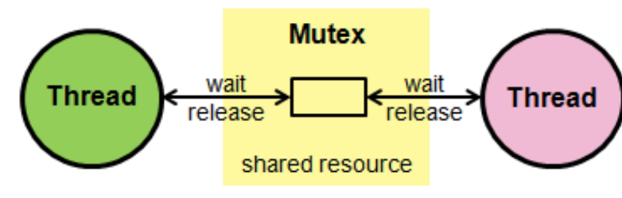
  
#### 세마포어란?(Semaphore) 
* 공유된 자원의 데이터를 여러 프로세스가 접근하는 것을 막는 것
* 세마포어는 사용자가 지정한 개수만큼 이 동기화 객체로 보호하는 자원에 대하여 접근할 수 있도록 하고 있다.
즉, 세마포어에서는 사용 가능한 자원의 개수를 세팅할 수 있도록 하고 있으며, 그 값은 세마포어 초기화 시에 세팅하게 된다.    
* 세마포어는 리소스의 상태를 나타내는 간단한 카운터로 생각할 수 있다.    
일반적으로 비교적 긴 시간을 확보하는 리소스에 대해 이용하게 되며, 유닉스 시스템의 프로그래밍에서 세마포어는 운영체제의 리소스를 경쟁적으로 사용하는 다중 프로세스에서 행동을 조정하거나 또는 동기화 시키는 기술이다.   
세마포어는 운영체제 또는 커널의 한 지정된 저장장치 내 값으로서, 각 프로세스는 이를 확인하고 변경할 수 있다. 확인되는 세마포어의 값에 따라, 그 프로세스가 즉시 자원을 사용할 수 있거나, 또는 이미 다른 프로세스에 의해 사용 중이라는 사실을 알게 되면 재시도하기 전에 일정 시간을 기다려야만 한다. 세마포어는 이진수 (0 또는 1)를 사용하거나, 또는 추가적인 값을 가질 수도 있다.   
세마포어를 사용하는 프로세스는 그 값을 확인하고, 자원을 사용하는 동안에는 그 값을 변경함으로써 다른 세마포어 사용자들이 기다리도록 해야한다.

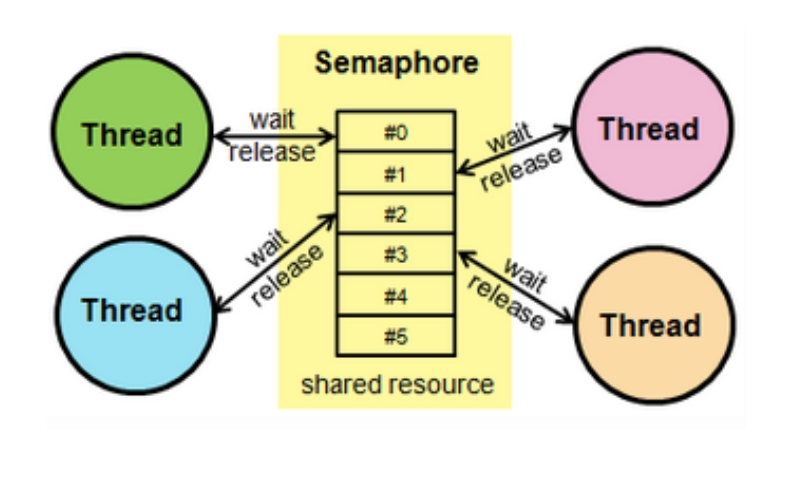

---

### 뮤텍스와 세마포어의 차이
#### Mutex & Semaphore 차이
1) Semaphore는 Mutex가 될 수 있지만 Mutex는 Semaphore가 될 수 없습니다.(Mutex 는 상태가 0, 1 두 개 뿐인 binary Semaphore)
2) Semaphore는 소유할 수 없는 반면, Mutex는 소유가 가능하며 소유주가 이에 대한 책임을 집니다. (Mutex 의 경우 상태가 두개 뿐인 lock 이므로 lock 을 ‘가질’ 수 있습니다.)
3) Mutex의 경우 Mutex를 소유하고 있는 쓰레드가 이 Mutex를 해제할 수 있습니다. 하지만 Semaphore의 경우 이러한 Semaphore를 소유하지 않는 쓰레드가 Semaphore를 해제할 수 있습니다. 
4) Semaphore는 시스템 범위에 걸쳐있고 파일시스템상의 파일 형태로 존재합니다. 반면 Mutex는 프로세스 범위를 가지며 프로세스가 종료될 때 자동으로 Clean up된다.
* ★★★ 가장 큰 차이점은 관리하는 동기화 대상이 갯수다. Mutex는 동기화 대상이 오직 하나뿐일 때, Semaphore는 동기화 대상이 하나 이상일 때 사용한다.

---

### 스케줄러(Scheduler)란?
#### 스케줄러 
프로세를 스케줄링하기 위한 Queue에는 세 가지 종류가 존재한다.
>+ __Job Queue__ : 현재 시스템 내에 있는 모든 프로세스의 집합
>+ __Ready Queue__ : 현재 메모리 내에 있으면서 CPU를 잡아 실행되기를 기다리는 프로세스의 집합
>+ __Device Queue__ : Device I/O 작업을 대기하고 있는 프로세스의 집합

##### 장기 스케줄러(Long-term scheduler or job scheduler)
메모리는 한정되어 있는데 여러 프로세스들이 한 번에 메모리에 올라올 경우에 대용량 메모리(일반적으로 디스크)에 임심로 저장된다. 이 Pool에 저장되어 있는 프로세스 중 어떤 프로세스에 메모리를 할당하여 Ready Queue 로 보낼지 경정하는 역할을 한다.
>+ 메모리와 디스크 사이의 스케줄링을 담당
>+ 프로세스에 메모리(및 각종 리소스)를 할당(admit)
>+ degree of multiprogramming 제어  
(메모리에 여러 프로그램이 올라가는 것) 몇 개의 프로그램이 올라갈 것인지를 제어
>+ 프로세스의 상태  
new => ready(in memory)  

##### 중기 스케줄러(Medium-term scheduler or Swapper)
>+ 여유 공간 마련을 위해 아직 실행하지 않아도 되는 프로세스를 통째로 메모리에서 제거하고 디스크로 쫓아냄 (__Swapping__)
>+ Performance (속도)는 느려지지만 여러 프로세스르 실행시키기 위해서는 반드시 필요한 작업  

##### 단기 스케줄러(short-term scheduler or CPU scheduler)
>+ CPU 와 메모리사이의 스케줄링을 담당
>+ 굉장히 자주 돌며 Ready Queue 에 존재하는 프로세스 중 어떤 프로세스를 running 시킬 것인지 결정
>+ 시간을 엄청 많이 나누어 그 순간마다 여러 프로세스를 실행시키는 즉, 멀티태스킹을 하게 해주는 스케줄러  

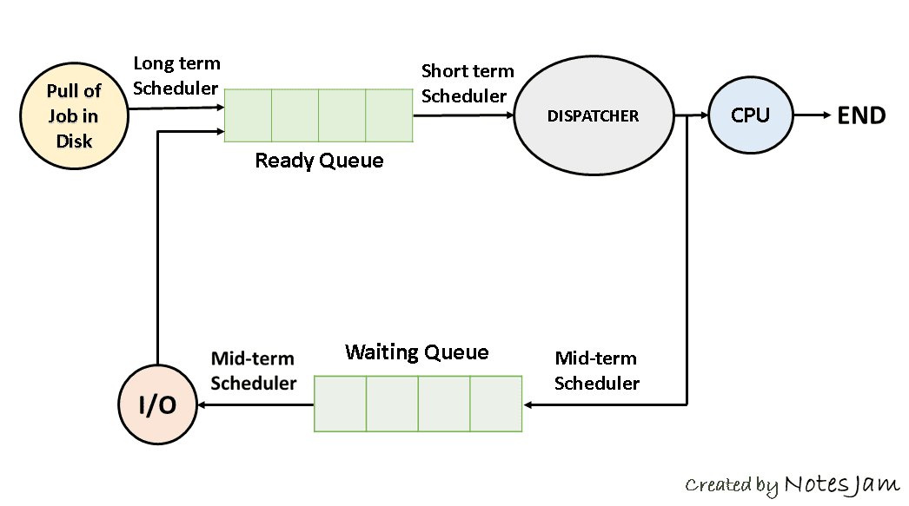
---

### 동기와 비동기
#### 동기(Sync) 와 비동기(Async)
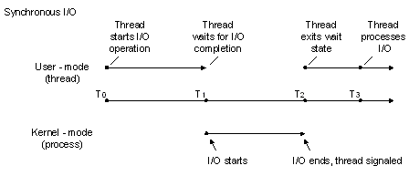  
<Synchronous I/O Model>  
  
Sync와 Async 를 구분하는 기준은 작업순서이다.  
동기식 모델은 모든 작업들이 일련의 순서를 따르며 그 순서에 맞게 동작한다. 즉, A,B,C 순서대로 작업이 시작되었다면 A,B,C 순서로 작업이 끝나야 한다. 설령 여러 작업이 동시에 처리되고 있다고 해도, 작업이 처리되는 모델의 순서가 보장된다면 이는 동기식 처리 모델이라고 할 수 있다.  
  
많은 자료들이 동기식 처리 모델을 설명할 때, 작업이 실행되는 동안 다음 처리를 기다리는 것이 (Wait) Sync 모델이라고도 하지만, 이는 잘 알려진 오해이다. 이 Wait Process 때문에 Blocking 과 개념의 혼동이 생기는 경우가 흔하다.  
동기 처리 모델에서 알아두어야할 점은 __작업의 순서가 보장된다는 점__ 뿐이다.

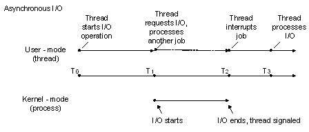  
<Asynchronous I/O Model>  
  
반면 비동기식 모델은 작업의 순서가 보장되지 않는다. 말 그대로 비동기(Asynchronous) 처리 모델로 A, B, C 순서로 작업이 시작되어도 A, B, C 순서로 작업이 끝난다고 보장할 수 없다.  
비동기식 처리 모델이 이득을 보는 경우는 각 작업이 분리될 수 있으며, Latency 가 큰 경우이다. 예를 들면 각 클라이언트 또는 작업 별로 Latency 가 발생하는 네트워크 처리나 File I/O 등이 훌륭한 적용 예시인 것

---
### 프로세스 동기화
#### 병행 프로세스(Concurrent Process)의 문제
>+ 병행 프로세스(Concurrent Process)는 두 개 이상의 프로세스들이 동시에 존재하여 실행 상태에 있는 것을 의미
>+ 컴퓨터 자원에는 어느 한 시점에 하나의 프로세스가 할당되어 수행되는데, 동시에 두 개 이상의 프로세스를 병행 처리하면 여러 문제점(race condition 과 같은)이 발생될 수 있다.  
이러한 문제를 해결하기 위해 임계 영역, 상호 배제 기법, 동기화 기법 등을 사용하는 것  

#### 임계 구역(Critical Section)
임계 구역(Critical Section)은 여러 개의 프로세스가 공유하는 데이터 및 자원에 대하여 어느 한 시점에서는 하나의 프로세스만 사용할 수 있도록 지정(공유 자원의 독점을 보장)하는 것을 의미
>+ 임계 구역에는 하나의 프로세스만 접근가능하며, 반납 후에만 다른 프로세스가 사용 가능
>+ 임계 구역은 특정 프로세스가 독점할 수 없으며, 임계 영역에서 수행 중인 프로세스는 인터럽트가 불가능
>+ 임계 구역의 자원, 데이터는 여러 프로세스가 사용해야 하므로 임계 구역 내에서의 작업은 신속하게 이루어져야 함  

#### 상호 배제 기법(Mutual Exclusion)
상호 배제(Mutual Exclusion)는 특정 프로세스가 공유 자원을 사용하고 있을 경우 다른 프로세스가 해당 공유 자원을 사용하지 못하게 제어하는 기법을 의미
>+ 공유 자원을 사용할 때 여러 프로세스가 번갈아가며 공유 자원을 사용하도록 하여 임계 구역을 유지하는 기법
>+ 상호 배제 기법을 구현하기 위한 방법은 소프트웨어적 구현과 하드웨어적 구현이 있다.
>>- 소프트웨어적 구현 방법 :  
데커(Dekker) 알고리즘, 피터슨(Perterson) 알고리즘 => 2개의 프로세스 기준  
Lamport의 빵집 알고리즘 => 여러 개의 프로세스 기준

>>- 하드웨어적 구현 방법 :  
Test & Set 기법과 Swap 명령어 기법이 있다.

#### 동기화 기법(Synchronization)
동기화 기법(Synchronization)은 두 개 이상의 프로세스를 한 시점에서는 동시에 처리할 수 없으므로 각 프로세스에 대한 처리 순서를 결정하는 것으로, 상호 배제의 한 형태
>+ 동기화를 구현할 수 있는 방법으로는 세마포어(Semaphore)와 모니터(Monitor)가 있다.

#### 세마포어(Semaphore)
>+ '신호기', '깃발'을 뜻하며, 각 프로세스에 제어 신호를 전달하여 순서대로 작업을 수행하도록 하는 기법
>+ 다익스트라가 제안했으며, P와 V라는 두 개의 연산에 의해 동기화를 유지시키고 상호 배제의 원리를 보장한다.
>>+ S 는 P 와 V 연산으로만 접근 가능한 세마포어 변수로, 공유 자원의 개수를 나타냄  
P 연산 : 자원을 사용하려는 프로세스들의 진입 여부를 자원의 개수(S)를 통해 결정하는 것으로 Wait 동작이라고 함  
S = S-1 : 자원 점유를 알리는 것으로 자원의 개수를 감소시킨다.
V 연산 : 대기 중인 프로세스를 깨우는 신호(Wake Up)로서, Signal 동작이라 한다.
S = S+1 : 자원 반납을 의미하므로 자원의 개수를 증가 시킨다.  
  
정리하자면 세마포어(S)는 프로세스가 임계 구역에 들어가려할 때(wait) 값이 감소하고, 임계 구역의 작업을 끝내고 반납할 때(signal) 값이 증가  
만약 세마포어가 0이 된다면 모든 자원들이 프로세스들에 의해 사용중이라는 것을 나타내며, 자원을 사용하기 위해서는 세마포어가 0보다 커지기를 기다려야 함 

#### 모니터(Monitor)
모니터(Monitor)는 동기화를 구현하기 위한 특수 프로그램 기법으로 특정 공유 자원을 프로세스에게 할당하는데 필요한 데이터와 이 데이터를 처리하는 프로시저로 구성
사실 세마포어(Semaphore)는 오래된 동기화 도구라고 할 수 있다. 그래서 현재 사용되는 도구 중 하나가 모니터이며 특히 자바 프로그램에서는 모니터에 대한 활용이 높다.
  
모니터의 경우 두 개의 Queue 가 있는데 각각 배타동기와 조건동기의 역할을 한다.  
배타동기의 Queue 는 하나의 스레드(thread)만 공유자원에 접근할 수 있게 하는 공간이다. 특정 스레드(thread)가 공유 자원을 사용하는 함수를 사용하고 있으면 다른 스레드(thread)는 대기해야 한다.  
조건동기의 Queue 는 진입 스레드(thread)가 블록되면서 새 스레드(thread)가 진입가능하게 하는 공간이다. 새 스레드(thread)는 조건동기로 블록된 스레드(thread)를 깨울 수 있다. 깨워진 스레드(thread)는 현재 스레드(thread)가 나가면 재진입할 수 있다.  
  
자바의 모니터를 보며 이해해보자.
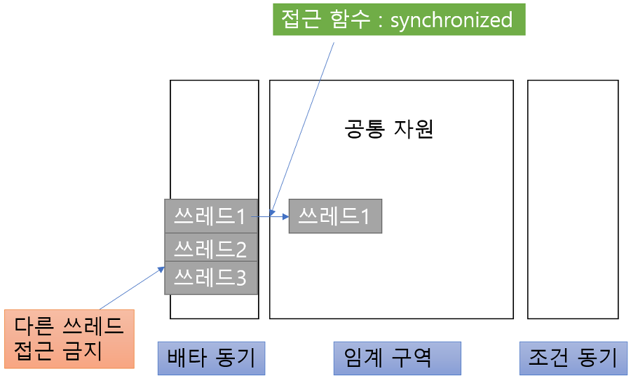

  

자바의 모든 객체는 모니터가 될 수 있다. 배타 동기는 synchronized 키워드를 통해 지정할 수 있다.  
조건 동기는 wait(), notify(), notifyAll() 함수를 사용한다. 배타 동기를 선언해주는 Synchronized 는 적어주는 것만으로도 상호 배제 원리를 만족시키는 함수로 만들어준다.
조건 동기의 경우 wait() 함수를 실행하면 진입 쓰레드를 조건 동기 Queue 에 블록 시키며, notify() 함수는 그렇게 블록된 함수를 새로운 스레드(thread)가 실행하는 방식으로 깨우게 되고, notifyAll()은 모든 스레드(thread)를 깨우는 것으로 사용할 수 있다. 

---

###교착상태(데드락, Deadlock)의 개념과 조건
### DeadLock의 개념    
-프로세스가 자원을 얻지 못해 다음 처리를 하지 못하는 상태로, ‘교착 상태’라고도 하며 시스템적으로 한정된 자원을 여러 곳에서 사용하려고 할 때 발생합니다.
-데드락이 발생할 수 있는 경우 :    
  
P1과 P2가 리소스 A, B 둘 다를 얻어야 한다고 가정할 때,
t1에 P1이 리소를 A를 얻고 P2가 리소스 B를 얻었다면 t2때 P1은 리소스 B를, P2는 리소스 A를 기다리게 됩니다.
하지만 서로 원하는 리소스가 상대방에게 할당되어 있기 때문에 이 두 프로세스는 무한정 기다리게 되는데 이러한 상태을 DeadLock상태라고 합니다.    
- 발생되는 상황  
    - 멀티 프로그래밍 환경에서 한정된 자원을 사용하려고 서로 경쟁하는 상황이 발생 할 수 있습니다.
    어떤 프로세스가 자원을 요청 했을 때 그 시각에 그 자원을 사용할 수 없는 상황이 발생할 수 있고 그 때는 프로세스가 대기 상태로 들어 가게됩니다.
    대기 상태로 들어간 프로세스들이 실행 상태로 변경 될 수 없을 때 이러한 상황을 교착 상태라 합니다.    

### 데드락 (Dead lock)의 발생 조건
- 교착 상태는 한 시스템 내에서 다음의 네 가지 조건이 동시에 성립 할 때 발생합니다
- 따라서, 아래의 네 가지 조건 중 하나라도 성립하지 않도록 만든다면 교착 상태를 해결할 수 있습니다.    
    1) 상호 배제 (Mutual exclusion)    
    -자원은 한 번에 한 프로세스만이 사용할 수 있어야 한다.
    2) 점유 대기 (Hold and wait)    
    -최소한 하나의 자원을 점유하고 있으면서 다른 프로세스에 할당되어 사용하고 있는 자원을 추가로 점유하기 위해 대기하는 프로세스가 있어야 한다.
    3) 비선점 (No preemption)    
    -다른 프로세스에 할당된 자원은 사용이 끝날 때까지 강제로 빼앗을 수 없어야 한다.
    4) 순환 대기 (Circular wait)    
    -프로세스의 집합 {P0, P1, ,…Pn}에서 P0는 P1이 점유한 자원을 대기하고 P1은 P2가 점유한 자원을 대기하고 P2…Pn-1은 Pn이 점유한 자원을 대기하며 Pn은 P0가 점유한 자원을 요구해야 한다.

### 데드락 (Dead lock) 처리    
  1. 교착 상태 예방(Prevention) 및 회피(Avoidance)    
    <예방(Prevention)법> : 교착 상태 발생 조건 중 하나를 제거함으로써 해결하는 방법 - 자원의 낭비가 심하다.    
    <회피(Avoidance)법> : 교착 상태가 발생하면 피해나가는 방법    
    - 은행원 알고리즘 (Banker’s Algorithm)    
    E,J,Dijkstra가 제안한 방법으로, 은행에서 모든 고객의 요구가 충족되도록 현금을 할당하는 데서 유래한 기법이다.프로세스가 자원을 요구할 때 시스템은 자원을 할당한 후에도 안정 상태로 남아있게 되는지를 사전에 검사하여 교착 상태를 회피하는 기법 
    안정 상태에 있으면 자원을 할당하고, 그렇지 않으면 다른 프로세스들이 자원을 해지할 때까지 대기함
    교착 상태가 되지 않도록 보장하기 위하여 교착 상태를 예방하거나 회피하는 프로토콜을 이용하는 방법    

  2. 교착 상태 탐지 및 회복 : 교착 상태가 되도록 허용한 다음에 회복시키는 방법 - 교착 상태 무시    
    -** 대부분의 시스템은 교착 상태가 잘 발생하지 않으며, 교착 상태 예방, 회피, 탐지, 복구하는 것은 비용이 많이 든다. **    
>>    <교착 상태 탐지 (Detection)>    
        - 자원 할당 그래프를 통해 교착 상태를 탐지할 수 있다.
        - 자원을 요청할 때마다 탐지 알고리즘을 실행하면 그에 대한 오버헤드가 발생한다    
>>    <교착 상태로부터 회복 (Recovery)>
        - 교착 상태를 일으킨 프로세스를 종료하거나, 할당된 자원을 해제함으로써 회복하는 것을 의미한다.
        - 프로세스를 종료하는 방법    
            1. 교착 상태의 프로세스를 모두 중지
            2. 교착 상태가 제거될 때까지 한 프로세스씩 중지
        - 자원을 선점하는 방법    
            1. 교착 상태의 프로세스가 점유하고 있는 자원을 선점하여 다른 프로세스에게 할당하며, 해당 프로세스를 일시 정지 시키는 방법
            2. 우선 순위가 낮은 프로세스, 수행된 횟수가 적은 프로세스 등을 위주로 프로세스의 자원을 선점한다.

출처: https://jwprogramming.tistory.com/12 

###사용자 수준 스레드와 커널 수준 스레드
사용자 레벨 스레드는 말그대로 우리가 #include <thread> 혹은 import를 통해 스레드를 이용하는 것을 의미한다.
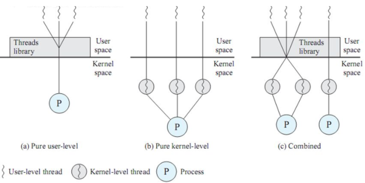
커널 레벨 스레드는 커널 내에 있는 스레드를 의미하게 되고 위와같이 3가지 방법으로 나뉜다.
  1. Pure user-level    
    커널 스레드 1개당 사용자 스레드 n개를 의미한다. 즉, 1 : n 방식이다.    
    이 방식같은 경우에는 커널은 사용자 스레드가 100개가 있어도 전혀 모르기 때문에 사용자 스레드에서 I/O가 하나라도 발생하면 해당 프로세스는 I/O가 풀릴 때 까지 영원히 block된다.
  2. Pure Kernel-level    
    n개의 커널 스레드가 n개의 사용자 스레드를 담당하게 된다. 즉 1:1 방식이다.
    1:1 방식이기에 병렬성은 좋으나 효율성 면에서 다소 떨어진다.
  3. Combined   
    커널 스레드와 사용자 스레드를 혼합하여 사용하는 방식이다. 위의 두 방식의 장점을 혼합한 방식이라 생각 할 수 있다.

####커널 레벨 스레드
- 커널 스레드는 가장 가벼운 커널 스케쥴링 단위다. 
- 하나의 프로세스는 적어도 하나의 커널 스레드를 가지게 된다. 
- 커널 영역에서 스레드 연산을 수행하게 된다.
- 커널이 스레드를 관리하기 때문에 커널에 종속적이다.
- 프로그래머 요청에 따라 스레드를 생성하고 스케줄링하는 주체가 커널이면 커널 레벨(Kernel Level) 스레드라고 한다.

####커널 레벨 스레드 장점
- 프로세스의 스레드들을 몇몇 프로세서에 한꺼번에 디스패치 할 수 있기 때문에 멀티프로세서 환경에서 매우 빠르게 동작한다.
- 다른 스레드가 입출력 작업이 다 끝날 때까지 다른 스레드를 사용해 다른 작업을 진행할 수 있다. 
- 커널이 각 스레드를 개별적으로 관리할 수 있다. 
- 커널이 직접 스레드를 제공해 주기 때문에 안정성과 다양한 기능이 제공된다.

####커널 레벨 스레드 단점
- 스케줄링과 동기화를 위해 커널을 호출하는데 무겁고 오래걸린다.(저장한 내용을 다시 불러오는 과정이 필요)
- 즉, 사용자 모드에서 커널 모드로의 전환이 빈번하게 이뤄져 성능 저하가 발생한다.
- 사용자가 프로그래밍할 때 구현하기 어렵고 자원을 더 많이 소비하는 경향이 있다.

####사용자 레벨 스레드
- 사용자 영역에서 스레드 연산을 수행한다. 
- 사용자 영역에서 스레드 연산을 수행하기 때문에 운영체제에 투명하다. 
- 커널에 의존적이지 않은 형태로 스레드의 기능을 제공하는 라이브러리를 활용하는 방식이 사용자 레벨(User Level) 스레드다.

####사용자 레벨 스레드 장점
- 운영체제에서 스레드를 지원할 필요가 없다. 
- 스케줄링 결정이나 동기화를 위해 커널을 호출하지 않기 때문에 인터럽트가 발생할 때 커널 레벨 스레드보다 오버헤드가 적다.
- 즉, 위의 말은 사용자 영역 스레드에서 행동을 하기에 OS Scheduler의 context switch가 없다(유저레벨 스레드 스케줄러를 이용).
- 커널은 사용자 레벨 스레드의 존재조차 모르기 때문에 모드 간의 전환이 없고 성능 이득이 발생한다

####사용자 레벨 스레드 단점
- 시스템 전반에 걸친 스케줄링 우선순위를 지원하지 않는다. (무슨 스레드가 먼저 동작할 지 모른다.)
- 프로세스에 속한 스레드 중 I/O 작업등에 의해 하나라도 블록이 걸린다면 전체 스레드가 블록된다.

cf)    
-커널?    
    운영체제의 다른 모든 부분에 여러 기본적인 서비스를 제공하고 컴퓨터 하드웨어와 프로세스의 보안을 책임진다. 한정된 시스템 자원을 효율적으로 관리하여 프로그램의 실행을 원활하게 한다.    
-Context Switching?    
    현재 진행하고 있는 Task(Process, Thread)의 상태를 저장하고 다음 진행할 Task의 상태 값을 읽어 적용하는 과정을 말합니다.

