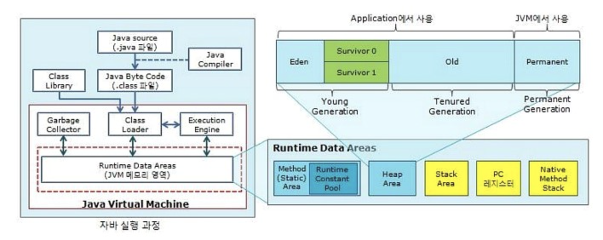
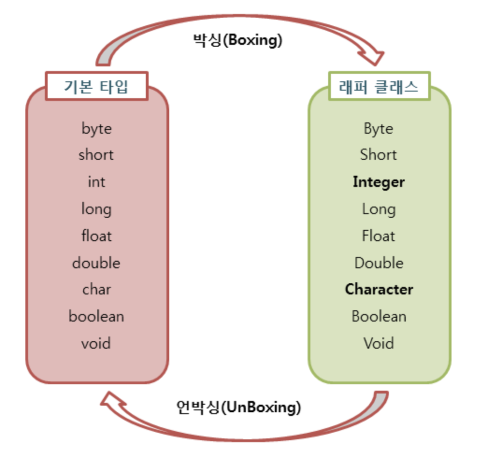

# Java

**:Contents**
* [컴파일 과정을 말해보라] 
* [interface와 abstract class차이]
* [캡슐화와 은닉화? 차이는 무엇인가?]
* [String, StringBuilder, StringBuffer의 차이는]
* [JAVA의 Garbage Collector는 어떻게 동작하는지.]

* [자바 다이나믹 프록시]
* [enum 이란]
* [자바에서 == 와 Equals() 메서드의 차이는]
* [java의 접근 제어자의 종류와 특징]
* [Java SE와 Java EE 애플리케이션 차이]

* [java의 final 키워드 (final/finally/finalize)]
* [리플렉션이란]
* [Wrapper class]
* [OOP의 4가지 특징]
추상화(Abstraction), 캡슐화(Encapsulation), 상속(Inheritance), 다형성(Polymorphism)
* [OOP의 5대 원칙 (SOLID)]

* [java의 non-static 멤버와 static 멤버의 차이]
* [java의 main 메서드가 static인 이유]
* [Annotation]
* [java 직렬화(Serialization)와 역직렬화(Deserialization)란 무엇인가]
* [JVM 구조]

* [클래스, 객체, 인스턴스의 차이]
* [객체(Object)란 무엇인가]
* [Call by Reference와 Call by Value의 차이]
* [제네릭에 대해 설명해주시고, 왜 쓰는지 어디세 써 봤는지 알려주세요.]
* [CheckedException과 UnCheckedException의 차이를 설명하시오.]

* [Java Collections Framework]
java Map 인터페이스 구현체의 종류 ,java Set 인터페이스 구현체의 종류 ,java List 인터페이스 구현체의 종류
* [HashMap vs HashTable vs ConcurrentHashMap의 차이를 설명하시오.]
* [깊은복사 , 얇은복사의 차이]
* [동기화와 비동기화의 차이(Syncronous vs Asyncronous)]
* [Stream이란]

* [Lambda란]
* [자바에 함수형 인터페이스에 선언문이 하나인 이유]
* [new String()과 ""의 차이에 대해 설명해주세요.]
* [오버로딩과 오버라이딩의 차이]

---

### 컴파일 과정



1. 개발자가 .java파일을 생성한다.
2. build를 한다.
3. java compliler의 javac의 명령어를 통해 바이트코드(.class)를 생성

4. class loader를 통해 jvm내로 로드
5. 실행엔진을 통해 컴퓨터가 읽을 수 있는 기계어로 해석되어(각 운영체제에 맞는 기계어)<br>
 Runtime Data Area에 배치

`실행엔진`
* 실행 엔진은 바이트코드를 명령어 단위로 읽어서 실행하는데, 두 가지 방식을 혼합하여 사용한다. 

* Interpreter 방식
>> 바이트코드를 한 줄씩 해석, 실행하는 방식이다. 초기 방식으로, 속도가 느리다는 단점이 있다.

* JIT(Just In Time) 컴파일 방식 또는 동적 번역(Dynamic Translation)

>> 그래서 나온 것이 JIT(Just In Time) 컴파일 방식이다. 
>바이트코드를 JIT 컴파일러를 이용해 프로그램을 실제 실행하는 시점(바이트코드를 실행하는 시점)에 각 OS에 맞는 Native Code로 변환하여 실행 속도를 개선하였다. 
>하지만, 바이트코드를 Native Code로 변환하는 데에도 비용이 소요되므로, JVM은 모든 코드를 JIT 컴파일러 방식으로 실행하지 않고, 인터프리터 방식을 사용하다 일정 기준이 넘어가면 JIT 컴파일 방식으로 명령어를 실행한다. 

*** 또한, JIT 컴파일러는 같은 코드를 매번 해석하지 않고, 실행할 때 컴파일을 하면서 해당 코드를 캐싱해버린다. 이후에는 바뀐 부분만 컴파일하고, 나머지는 캐싱된 코드를 사용한다.** 

`출저`
https://blog.naver.com/software705/220645590756


### interface와 abstract class

`외형적 차이점`

`확장성`
* 인터페이스(be able to)
생성자를 가질 수 없어 객체화가 불가능<br>
디폴트 메서드 + 추상메서드로 구성<br>
다중 상속이 가능<br>


`추상화`
* 추상클래스(is a kind of)
생성자를 가지기 때문에 객채화가 가능<br>
필드를 가질 수 있다<br>
다중 상속 불가<br>

>> 외형적인 차이보다는 상용의 의도가 중요하다.

* 차 is a kind of 탈것
* 자전거 is a kind of 탈것
* 기차 is a kind of 탈것
* 버스 is a kind of 탈것

위와 같이 탈것에는 타는 종류의 필드이름과 탄다는 메서드가 공통으로 있을 것이다.<br>
이런 공통된 부분을 추상화 한 것을 추상클래스라고 한다.<br>


스프링을 통해 개발을 하면 service interface => serviceImpl class 이런식으로<br>
개발하는 패턴을 많이 봤을텐데 1개의 구현체만 만들고 과제가 끝난 경우가 많았을 것이다.<br>

그러면서 굳이 인터페이스를 사용해야한지도 의문이 들었을 것이다.<br>

나중에 확정성을 고려하여 이렇게 개발하는 것이라고 한다.<br>

ex) . paymentService => kbPaymentServiceImpl , lgPaymentServiceImpl
처음은 kb결제로 시작해서 LG결제등의 다른 결제 추가될 가능이 있다면 인퍼페이스를 사용하는게 적절하다.

그렇가면 더이상 확장될 가능성이 없다면 service interface => serviceImpl class 구조로 
개발할 필요가 없다.

>> 인터페이스를 사용하는 이유를 협업이라고 하기도한다.
> 하나의 규격을 만들어 놓으면 A개발자가 kbPaymentServiceImpl 개발을 / B개발자가 lgPaymentServiceImpl 개발을  협업이 가능하다.


### 캡슐화와 은닉화

`캡슐화는 관련된 요소들을 묶음으로써 캡슐 내부와 외부를 구별 짓는 장치`

관련된 요소들을 묶음 : 캡슐화란 데이터(속성)과 데이터를 처리하는 함수를 하나로
내부와 외부를 구별 : 객체 외부에서는 개체 내부 정보를 직접 접근하거나 조작할 수 없고,<br>
외부에서 접근할 수 있도록 정의된 오퍼레이션을 통해서만 관련 데이터에 접근할 수 있다
ex). getter ,setter

- 객체의 세부내용이 외부에 은폐(정보은닉)되어, 변경이 발생할 때 오류발생이 적어짐
- 각 객체가 가지고 있는 데이터들은 해당 객체 속에 숨어 있기 때문에 외부 객체에서 볼 수 없다.
- 객체들 간의 메시지를 주고 받을 때 각 객체의 세부 내용은 알 필요가 없으므로 인터페이스가 간결해지고, 객체간의 결합도가 낮아짐


`정보은닉은 캡슐내의 요소들에 대한 세부 구현사항을 외부에 숨기는 장치`

정보 은닉은 private 키워드를 활용해서 외부에서 클래스 내부의 정보에 접근하지 못하도록 하는 기능을 말합니다.

- 정보은닉은 캡슐화 되어 있는 데이터와 함에 대해서 외부에서 해당 함수가 어떻게 구현되어 있는지에 대한 세부 사항을 숨기는 것이다.
- 캡슐화가 되어 있다고 해서 반드시 정보은닉이 되는 것은 아니다.


### String, StringBuilder, StringBuffer의 차이는

* String 객체(불변)
불변이기 때문에 변하지 않는 문자열은 String을 사용한다.

>> 변하지 않은 문자열을 저장할때 적합 

* StringBuilder(가변)
비동기방식이기 때문에 Single Thread 환경하에서, 변화되는 문자열의 사용한다.
동기방식이기 때문에 처리속도는 제일 빠르다.

* StringBuffer(가변)
동기방식으로 저장되기 때문에 멀티쓰레드로 접근하거나 문자열이 변경될 경우에 사용한다.


>> 이 질문의 의도는 동기 , 비동기의 기준으로 보입니다.


### java의 final 키워드

`final 키워드`
>> 변수나 메서드 또는 클래스가 ‘변경 불가능’하도록 만든다.

* 원시(Primitive) 변수에 적용 시 해당 변수의 값은 변경이 불가능하다.
* 참조(Reference) 변수에 적용 시 참조 변수가 힙(heap) 내의 다른 객체를 가리키도록 변경할 수 없다.
* 메서드에 적용 시 해당 메서드를 오버라이드할 수 없다.
* 클래스에 적용 시 해당 클래스의 하위 클래스를 정의할 수 없다.

`finally`
>> try/catch 블록이 종료될 때 항상 실행될 코드 블록을 정의하기 위해 사용한다.

* finally는 선택적으로 try 혹은 catch 블록 뒤에 정의할 때 사용한다.
* finally 블록은 예외가 발생하더라도 항상 실행된다.
(단, JVM이 try 블록 실행 중에 종료되는 경우는 제외한다.)
* finally 블록은 종종 뒷마무리 코드를 작성하는 데 사용된다.
* finally 블록은 try와 catch 블록 다음과, 통제권이 이전으로 다시 돌아가기 전 사이에 실행된다.

`finalize`
쓰레기 수집기(GC, Garbage Collector)가 더 이상의 참조가 존재하지 않는 객체를 메모리에서 삭제하겠다고 결정하는 순간 호출된다.


>> 개념만 알고 사용은 하면 안된다.
> 종료자는 사용하면 안 된다. 예측이 불가능하고 대체로 위험하고 일반적으로 필요하지 않다.


`출저`
https://blog.naver.com/software705/221369217211

### 리플렉션이란
구체적인 Class Type을 알지 못해도, 그 클래스의 메서드, 변수들에 접근 할 수 있도록 해주는 JAVA API 입니다.
gc의  대상이 되지 않은 영역 Method Area 영역을 뒤져서 클래스에 대한 정보를 가져온다.
(Method Area에는 Static 변수들을 비롯한, 생성자 , Method, SuperClass등 의 정보가 올라가게됩니다.)


`리플렉션으로부터 얻을수있는 정보`
- ClassName
- Class Modifiers
- Package Info
- Superclass
- Implemented Interfaces
- Constructors
- MethodsFields
- Annotations


`reflection 관련 클래스들`
* Class 클래스
* String getName
* 클래스의 이름을 리턴한다.
* Method 클래스

>> 메서드에 대한 정보는 얻을 수 있지만 Method 클래스는 생성자가 없으므로 Class 클래스의 
getMethods() 메서드를 사용하거나 getDeclearedMethod() 메서드를 사용해야한다.

`Filed 클래스`

>>Filed 클래스도 Method 클래스와 같이 Class 클래스의 
getFiled() 메서드를 사용하거나 getDeclearedFileds() 메서드를 사용해야한다. 

그렇다면 어떻게 어디에 사용되는 것일까?

`DB Connection을 맺는 부분`

```java

Class.forName("oracle.jdbc.driver.OracleDriver");

```


`spring framework`
스프링에서 BeanFactory라는 Container를 공부할 때 객체가 호출되면 객체의 인스턴스를 생성하게 되는데 이 때 필요하게 됩니다.<br>
즉, 프레임워크에서 유연성있는 동작을 위해 쓰게 됩니다.

스프링에 @autowired 어노테이션에 동작에는 reflection 사용되고 있음.


>> spring framework을 만든 java의 핵심 기술은 리플렉션과 다이나믹 프록시 2가지이다.


`출저`
https://blog.naver.com/software705/221369217211

###Wrapper class

기본 자료타입(primitive type)을 객체로 다루기 위해서 사용하는 클래스들을 래퍼 클래스(wrapper class)라고 합니다. 



`자동박싱 자동언박싱`

기본타입 값을 직접 박싱, 언박싱하지 않아도 자동적으로 박싱과 언박싱이 일어나는 경우가 있습니다. <br>
자동 박싱의 포장 클래스 타입에 기본값이 대입될 경우에 발생합니다. <br>
예를 들어 int타입의 값을 Integer클래스 변수에 대입하면 자동 박싱이 일어나 힙 영역에 Integer객체가 생성됩니다.<br>

`값비교`

레퍼클래스 == 기본형
레퍼클래스.equals(기본형)
레퍼클래스 == 레퍼클래스
레퍼클래스.equals(레퍼클래스)

* 래퍼 객체는 내부의 값을 비교하기 위해 == 연산자를 사용할 수 없습니다.
* 이 연산자는 내부의 값을 비교하는 것이 아니라 래퍼 객체의 참조 주소를 비교하기 때문입니다.
* 비교 대상인 래퍼는 객체이므로 서로의 참조 주소가 다릅니다. <br>
객체끼리의 비교를 하려면 내부의 값만 얻어 비교해야 하기에 equals를 사용해야 합니다.
* 래퍼 클래스와 기본자료형과의 비교는 == 연산과 equals연산 모두 가능합니다. 
* 그 이유는 컴파일러가 자동으로 오토박싱과 언박싱을 해주기 때문입니다.

>> 기본형으로 처리할 수 있는 부분을 wrapper class로 처리하지 말자.
> 기본형을 박싱하면 생기는 오버헤드때문에 성능이 기본형으로 처리하는 경우보다 상당히 떨어진다.


`출저`
https://coding-factory.tistory.com/547