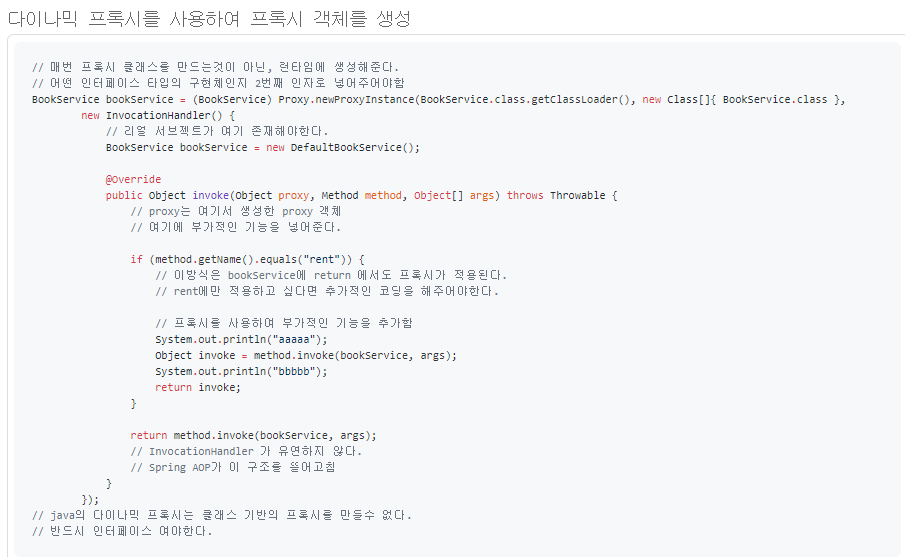
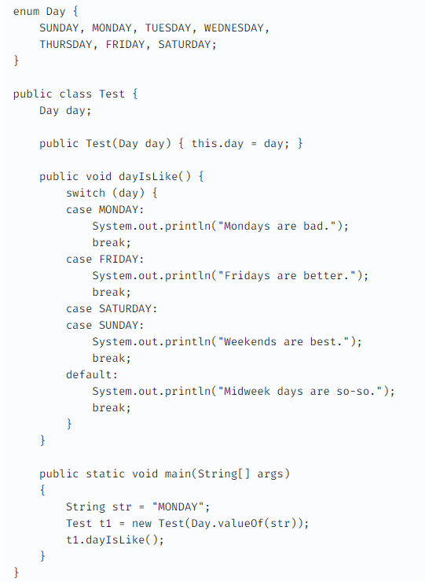
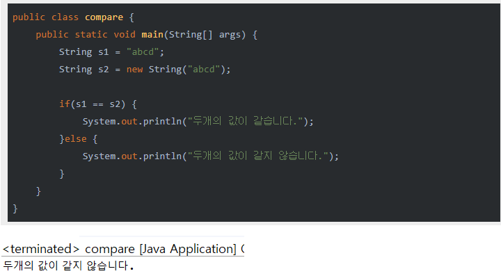
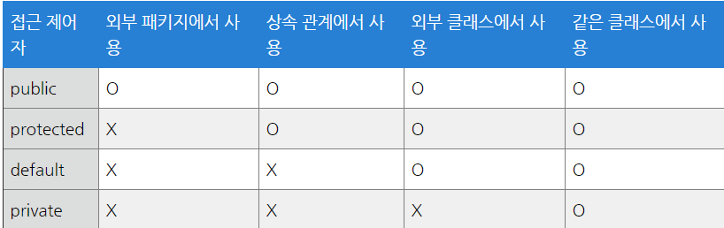

# Java

**:Contents**
* [컴파일 과정을 말해보라]
* [interface와 abstract class차이]
* [캡슐화와 은닉화? 차이는 무엇인가?]
* [String, StringBuilder, StringBuffer의 차이는]
* [JAVA의 Garbage Collector는 어떻게 동작하는지.]

* [자바 다이나믹 프록시]
* [enum 이란]
* [자바에서 == 와 Equals() 메서드의 차이는]
* [java의 접근 제어자의 종류와 특징]
* [Java SE와 Java EE 애플리케이션 차이]

* [java의 final 키워드 (final/finally/finalize)]
* [리플렉션이란]
* [Wrapper class]
* [OOP의 4가지 특징]
추상화(Abstraction), 캡슐화(Encapsulation), 상속(Inheritance), 다형성(Polymorphism)
* [OOP의 5대 원칙 (SOLID)]

* [java의 non-static 멤버와 static 멤버의 차이]
* [java의 main 메서드가 static인 이유]
* [Annotation]
* [java 직렬화(Serialization)와 역직렬화(Deserialization)란 무엇인가]
* [JVM 구조]

* [클래스, 객체, 인스턴스의 차이]
* [객체(Object)란 무엇인가]
* [Call by Reference와 Call by Value의 차이]
* [제네릭에 대해 설명해주시고, 왜 쓰는지 어디세 써 봤는지 알려주세요.]
* [CheckedException과 UnCheckedException의 차이를 설명하시오.]

* [Java Collections Framework]
java Map 인터페이스 구현체의 종류 ,java Set 인터페이스 구현체의 종류 ,java List 인터페이스 구현체의 종류
* [HashMap vs HashTable vs ConcurrentHashMap의 차이를 설명하시오.]
* [깊은복사 , 얇은복사의 차이]
* [동기화와 비동기화의 차이(Syncronous vs Asyncronous)]
* [Stream이란]

* [Lambda란]
* [자바에 함수형 인터페이스에 선언문이 하나인 이유]
* [new String()과 ""의 차이에 대해 설명해주세요.]
* [오버로딩과 오버라이딩의 차이]

-----------------------------------------------------------------------
### [자바 다이나믹 프록시]
- 런타임 시점에(컴파일 시점이 아닌) 특정 인터페이스들을 구현하는 클래스 혹은 인스턴스를 만드는 기술

#### 다이나믹 프록시 사용 방법

1. Proxy.newProxyInstance 메소드를 이용해 프록시 객체를 생성한다.    
-Proxy.newProxyInstance    
(구현할 대상의 클래스 로더 , 클래스 배열 선언 -> 인터페이스 목록 : 어떤 인터페이스 타입의 구현체 인가를 선언, InvocationHandler())    
-첫번째 인자는 프록시 객체를 생성할 인터페이스 타입의 클래스로더    
-두번째 인자는 해당 프록시가 어떤 인터페이스를 구현하는 구현체인가    
-세번째 인자는 이를 구현하는 InvocationHandler 이다.    

2. InvocationHandler는 invoke 메소드를 구현한다.    
-첫번째 인자는 newProxyInstance를 사용해 생성된 프록시 객체의 참조    
-두번째 인자는 프록시를 통해 호출된 메소드의 참조    
-세번째 인자는 해당 메소드의 파라메터들의 참조    

3. invoke 메소드 내에서 method.invoke를 통해 메소드를 호출할 수 있다.    
-기존의 bookServiceProxy를 구현하기 위해 InvocationHandler내에서 BookService 리얼 서브젝트가 존재해야한다. 또한 method.invoke 시 리얼 서브젝트의 메소드를 호출한다. 
 만약 프록시 객체를 통해 부가적인 기능을 추가하고싶다면 invoke 메소드 내에서 구현을 해주면 된다.

#### 다이나믹 프록시의 단점
1. 유연한 구조가 아니다.    
   만약 구현부가 복잡해지고 메소드마다 조건적으로 부가기능을 추가하고싶다면 invoke 메소드내에 매우 난잡한 코드가 들어갈 확률이 높다.    
   > 이러한 단점을 보완하여 스프링 AOP에서는 해당 구조를 스프링이 정의한 인터페이스로 정의하였다. 그래서 스프링 AOP를 Proxy 기반 AOP라고 불리는 것이다.
2. 반드시 인터페이스 기반의 프록시여야 한다. [클래스 기반의 프록시는 생성 불가]

- cf) https://pupupee9.tistory.com/151

-----------------------------------------------------------------------
#### [enum 이란]

- 열거형 상수인 enum(enumeration), 이넘은 관련이 있는 상수들의 집합. 
- 자바에서는 final로 String과 같은 문자열이나 숫자들을 나타내는 기본 자료형의 값을 고정할 수 있다. 이렇게 고정된 값을 상수라고 합니다.    
  어떤 클래스가 상수만으로 작성되어 있으면 반드시 class로 선언할 필요는 없습니다. 이럴 때 class로 선언된 부분에 enum이라고 선언하면 이 객체는 상수의 집합이다. 
- 모든 enum 상수들은 객체 타입의 enum이다. (new Color()) / enum 타입은 switch 구문의 아규먼트로 넣을 수 있다. 
- 모든 enum은 상수는 내부적으로 public static final 으로 정의되고, enum 이름으로 사용할 수있다. final이므로 자식 enum을 만들 수는 없다.
  enum 내부에 main() 메서드를 선언할 수 있다. 그래서 enum을 커맨드 프롬프트에서 직접 호출할 수 있다.
- Enum은 컴파일 당시 우리가 모든 가능한 값을 알고있는 경우 사용된다.
- 자동완성, 오타검증, 텍스트 리팩토링 등등에 사용하고 허용 가능한 값들을 제한할 수 있다.
- 내용의 추가가 필요하더라도, Enum 코드외에 수정할 필요가 없습니다.
- 다른 언어의 enum과 달리 Java의 Enum은 완전한 기능을 갖춘 클래스
- enum은 생성자를 가질 수 있고 enum 클래스가 로드 될 때 각 상수들이 개별적으로 실행된다.
  enum 객체를 명시적으로 생성할 수 없으므로 enum 생성자를 직접 부를 수는 없다. (new Color() 형식으로 부를 수 없음)
- enum생성자는 왜 private인가?
>  => Java에서 enum 타입은 열거형을 의미하는 특별한 형태의 클래스. 일반 클래스와 같이 생성자(Constructor)가 있어야 합니다.     
     물론 생성자를 만들어주지 않아도 Java가 default 생성자를 만들어주긴 하지만, enum은 생성자의 접근 제어자를 private로 지정 해야합니다.    
	 다른 패키지나 클래스에서 enum 타입에 접근해서 동적으로 어떤 값을 정해줄 수 없습니다. 따라서 컴파일 시에 타입안정성이 보장됩니다    
	 (해당 enum클래스 내에서 까지도 new키워드로 인스턴스 생성이 불가능하며 newInstance(), clone()등의 메소드도 사용 불가).     
	 이 때문에 생성자의 접근제어자를 private으로 설정해야 합니다. 이렇게 되면 외부에서 접근 가능한 생성자가 없으므로 enum타입은 실제적으로 final과 다름이 없다.    
	 클라이언트에서 enum의 인스턴스를 생성할 수 없고 상속을 받을 수도 없으므로, 클라이언트의 관점에서 보면 인스턴스는 없지만 선언된 enum 상수는 존재하는 셈입니다.    
	 결국 enum타입은 인스턴스 생성을 제어하며, 싱글톤(singleton)을 일반화합니다. [enum타입은 싱글톤을 구현하는 하나의 방법으로 사용]    
- enum 메소드
> values() : 모든 상수 반환    
> rdinal() : 상수 인덱스 반환    
> valueOf() : 상수 문자 값 반환

- cf) https://velog.io/@pop8682/Enum-27k067ns4a
- cf) https://woowabros.github.io/tools/2017/07/10/java-enum-uses.html

------------------------------------------------------------------

### [자바에서 == 와 Equals() 메서드의 차이는]

#### String 변수 생성시 주소할당
1. 리터럴을 이용한 방식  :      String s1 = "abcd";
2. new 연산자를 이용한 방식  :  String s2 = new String("abcd");
 > 리터럴을 사용하게 되면 string constant pool이라는 영역에 존재하게 되고 new를 통해 String을 생성하면 Heap 영역에 존재하게 됩니다.    
 > String을 리터럴로 선언할 경우 내부적으로 String의 intern() 메서드가 호출되게 됩니다.     
 > intern() 메서드는 주어진 문자열이 string constant pool에 존재하는지 검색하고 있다면 그 주소값을 반환하고 없다면 string constant pool에 넣고 새로운 주소값을 반환합니다. 

#### 주소값 비교(==)와 값 비교(equals)
- " == " : 비교하고자 하는 두개의 대상의 주소값을 비교
- " String클래스의 equals 메소드 " : 비교하고자 하는 두개의 대상의 값 자체를 비교
 > 일반적인 타입들 int형, char형등은 Call by Value 형태로 기본적으로 대상에 주소값을 가지지 않는 형태로 사용됩니다.    
 > 하지만 String은 일반적인 타입이 아니라 클래스입니다.    
 > 클래스는 기본적으로 Call by Reference형태로 생성 시 주소값이 부여됩니다.    
 >그렇기에 String타입을 선언했을때는 같은 값을 부여하더라도 서로간의 주소값이 다를 수가 있습니다.    

- ※ 자바에서 문자열을 비교하려면 ==가 아닌 equals라는 메서드를 활용하여 두개의 값을 비교해주어야 합니다.
- cf) https://coding-factory.tistory.com/536

------------------------------------------------------------------
### java의 접근 제어자의 종류와 특징
#### 접근제어자 종류
- private : private이 붙은 변수, 메소드는 해당 클래스에서만 접근이 가능
- default : 접근제어자를 별도로 설정하지 않는다면 접근제어자가 없으면 default로 설정 / 동일 패키지 내에서만 접근이 가능하다.
- protected : 동일 패키지내의 클래스 또는 해당 클래스를 상속받은 외부 패키지의 클래스에서 접근이 가능하다.
- public : 어떤 클래스에서라도 접근이 가능
 

> ※ private -> default -> protected -> public 순으로 보다 많은 접근을 허용한다    
> ※ 클래스내의 클래스를 inner 클래스라고 부르는데 이러한 inner클래스에도 역시 접근제어자를 붙여서 접근을 제어할 수 있다.

- cf) https://lifejusik1004.tistory.com/entry/JAVA-%EC%A0%91%EA%B7%BC-%EC%A0%9C%EC%96%B4%EC%9E%90%EC%9D%98-%EC%A2%85%EB%A5%98%EC%99%80-%EC%82%AC%EC%9A%A9-%EC%9D%B4%EC%9C%A0
------------------------------------------------------------------

### [Java SE와 Java EE 애플리케이션 차이]

#### JAVA SE (Java Standard Edition)
- 표준 자바 플랫폼 / 자바 API집합체(패키지)    
- 자바 표준 에디션은 가장 기본이 되는 에디션입니다.흔히 자바 언어라고 하는 대부분의 패키지가 포함된 에디션이며      
주요 패키지로는 java.lang.*, java.io.*, java.util.*, java.awt.*, javax.rmi.*, javax.net.* 등이 있습니다.

#### JAVA EE (Java Enterprise Edition)
- 자바를 이용한 서버측 개발을 위한 플랫폼 / 기업환경의 시스템을 구현하기 위한 서버측 컴포넌트 모델    
- 기존 SE에서 서버측을 위한 가능이 더 추가되어있습니다.    
- 엔터프라이즈 환경을 위한 도구로 자바로 구현되는 웹프로그래밍에서 가장 많이 사용되는 JSP, Servlet을 비롯하여, 데이터베이스에 연동하는 JDBC, 그 외에도 JNDI, JTA, EJB 등의 많은 기술들이 포함되어 있습니다.
- ※ Java EE는 Java SE의 API에 추가로(lib 디렉토리에 포함되어 있는 JAR파일들)의 차이입니다.

------------------------------------------------------------------
